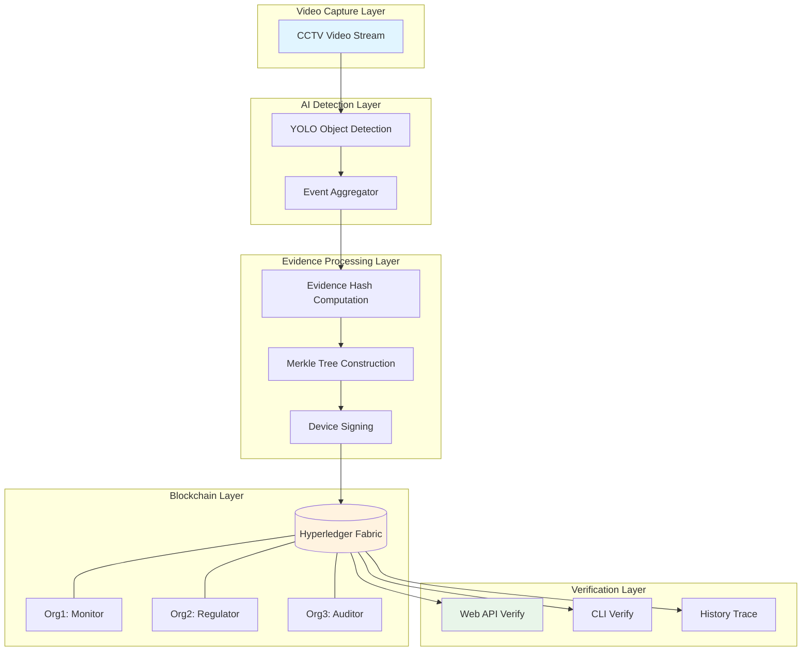

<div align="center">

# 🔐 SecureLens

**Blockchain-based Smart Video Surveillance Evidence Management System**

[](https://www.python.org/)
[](https://fastapi.tiangolo.com/)
[](https://www.hyperledger.org/use/fabric)
[](https://opensource.org/licenses/MIT)

*End-to-end solution from video detection to blockchain notarization*

🌐 **Language / 语言**: [English](README.en.md) | [中文](README.md)

[Quick Start](#-quick-start) • [Features](#-core-features) • [Architecture](#-system-architecture) • [Docs](#-documentation)

</div>

## 📖 Overview

SecureLens is an evidence management system that deeply integrates AI video analysis with blockchain technology, achieving full-pipeline automation from surveillance video to trusted on-chain notarization.

### Why SecureLens?

- ✅ **Immutable** - Powered by Hyperledger Fabric; evidence on-chain is permanently traceable
- ✅ **Efficient Batching** - Merkle Tree batch anchoring reduces on-chain storage costs
- ✅ **Device-level Signatures** - ECDSA digital signatures ensure trustworthy evidence provenance
- ✅ **Privacy Protection** - Private Data Collections (PDC) protect sensitive raw images
- ✅ **Real-time Detection** - YOLO model with intelligent event aggregation
- ✅ **Multi-party Collaboration** - 3-org architecture supporting monitoring, regulatory, and audit parties

---

## 🎯 Core Features

<table>
<tr>
<td width="50%">

### 🎥 Intelligent Video Analysis
- YOLO real-time object detection (people, vehicles, etc.)
- Multi-frame tracking and event aggregation
- State machine: `pending → confirmed → closed`
- Automatic evidence snapshot and metadata generation

</td>
<td width="50%">

### 🔗 Blockchain Notarization
- Merkle Tree batch anchoring (10-second window)
- Device private key ECDSA signing
- Dual endorsement policy (Org1 + Org2)
- Single and batch anchoring modes

</td>
</tr>
<tr>
<td width="50%">

### ✅ Evidence Verification
- On-chain Merkle proof verification
- Local hash consistency check
- Web API + CLI dual verification entry
- Full history traceability

</td>
<td width="50%">

### 🔒 Privacy & Audit
- PDC protects raw images
- Rectification workflow (create/submit/confirm)
- Cross-organization audit trail export
- Fine-grained access control (ACL)

</td>
</tr>
<tr>
<td width="50%">

### 📋 Work Order Management
- Full work order lifecycle management
- Status transition visualization
- Automatic overdue order detection
- Multi-organization collaborative workflow

</td>
<td width="50%">

### 🎭 Role-based Permissions
- Three-org role switching (Org1/Org2/Org3)
- Dynamic permission control
- Audit report export and verification
- Auto-triggered work order mechanism

</td>
</tr>
</table>

---

## 🏗️ System Architecture



### Organization Structure

| Org | Role | Permissions |
|-----|------|-------------|
| **Org1** | Monitoring Party | Create evidence, submit rectification, read private data |
| **Org2** | Regulatory Party | Create evidence, create work orders, confirm rectification, read private data |
| **Org3** | Audit Party | Read-only queries, export audit trail |

---

## 📁 Project Structure

```
SecureLens/
├── 🐍 web_app.py              # FastAPI Web service + real-time detection
├── 🎯 detect.py               # Standalone YOLO detection runner
├── ⚓ anchor_to_fabric.py     # Offline anchoring script
├── ✅ verify_evidence.py      # CLI verification tool
├── ⚙️  config.py               # Unified configuration management
├── 📦 requirements.txt        # Python dependencies
├── 📋 .env.example            # Configuration template
│
├── 🔧 services/               # Core service modules
│   ├── detection_service.py   # YOLO detection & video stream management
│   ├── event_aggregator.py    # Multi-frame event aggregation & state machine
│   ├── fabric_client.py       # Hyperledger Fabric SDK client
│   ├── merkle_utils.py        # Merkle Tree construction & proof verification
│   ├── crypto_utils.py        # ECDSA signing & hash utilities
│   └── workorder_service.py   # Work order lifecycle management
│
├── 📜 chaincode/              # Hyperledger Fabric smart contract
│   ├── chaincode.go           # Fabric smart contract (Go)
│   ├── chaincode_test.go      # Go unit tests
│   ├── collections_config.json # Private data collection config
│   ├── go.mod / go.sum        # Go module definitions
│   └── vendor/                # Vendored Go dependencies
│
├── 🚀 scripts/                # Network & deployment scripts
│   ├── stage3_setup_network.sh # 3-org Fabric network startup
│   ├── stage3_verify.sh        # Acceptance test suite
│   └── check_stage1.sh         # Stage 1 environment check
│
├── 📄 templates/              # Jinja2 HTML templates
│   ├── index.html             # Main monitoring dashboard
│   ├── workorder.html         # Work order management page
│   ├── audit.html             # Audit report page
│   └── config.html            # System configuration page
│
├── 🧪 tests/                  # Python unit tests
│   ├── test_crypto_utils.py
│   ├── test_event_aggregator.py
│   └── test_merkle_utils.py
│
├── 🔑 device_keys/            # Device signing key pairs (ECDSA)
│   └── cctv-kctmc-apple-01/   # Per-device key directory
│
├── 📁 evidences/              # Local evidence storage
│   ├── events/                # Individual event snapshots & metadata
│   └── batches/               # Merkle batch records
│
└── 📚 docs/                   # Documentation files
    ├── FABRIC_RUNBOOK.md       # Fabric operations manual
    ├── EXECUTE_INSTRUCTIONS.md # Step-by-step execution guide
    ├── FABRIC_RESET_GUIDE.md   # Network reset & troubleshooting
    ├── QUICKSTART_PHASE4.md    # Quick start guide
    ├── PHASE4_SUMMARY.md       # Phase 4 feature summary
    ├── PHASE4_COMPLETION_REPORT.md # Completion report
    └── CHANGELOG.md            # Version history
```

## 🚀 Quick Start

> 💡 **First time?** Read [Quick Start Guide (Phase 4)](QUICKSTART_PHASE4.md) for a complete walkthrough with demo scenarios and FAQ.

### Prerequisites

- Python 3.10+
- Go 1.20+
- Docker & Docker Compose
- Hyperledger Fabric 2.x (via fabric-samples)

### Step 1️⃣: Start the Blockchain Network

> ⚠️ **Important**: If you previously ran a Fabric network, clean it up first. See [Fabric Network Reset Guide](FABRIC_RESET_GUIDE.md).

Start the 3-org Fabric network:

```bash
cd /path/to/CCTV-W-FABRIC-main
./scripts/stage3_setup_network.sh
```

Deploy the smart contract (with dual endorsement policy + PDC):

```bash
cd ~/projects/fabric-samples/test-network
./network.sh deployCC \
  -ccn evidence \
  -ccp /path/to/CCTV-W-FABRIC-main/chaincode \
  -ccl go \
  -ccep "AND('Org1MSP.peer','Org2MSP.peer')" \
  -cccg /path/to/CCTV-W-FABRIC-main/chaincode/collections_config.json
```

### Step 2️⃣: Configure Environment

```bash
cp .env.example .env
```

Key configuration items:

```bash
# Fabric settings
FABRIC_SAMPLES_PATH=~/projects/fabric-samples
CHANNEL_NAME=mychannel
CHAINCODE_NAME=evidence

# Video source (RTSP/HTTP/local file)
VIDEO_SOURCE=https://cctv1.kctmc.nat.gov.tw/6e559e58/

# Device signing keys
DEVICE_CERT_PATH=device_keys/default/cert.pem
DEVICE_KEY_PATH=device_keys/default/key.pem
DEVICE_SIGNATURE_REQUIRED=true

# Merkle batch window (seconds)
MERKLE_BATCH_WINDOW_SECONDS=10
```

### Step 3️⃣: Install Dependencies and Start

```bash
python3 -m venv venv
source venv/bin/activate
pip install -r requirements.txt
python -m uvicorn web_app:app --host 0.0.0.0 --port 8000
```

🎉 Visit **http://127.0.0.1:8000** to access the live monitoring dashboard!

### Step 4️⃣: Access System Pages

- 🏠 **Home (Video Monitor)**: http://127.0.0.1:8000
- 📋 **Work Order Management**: http://127.0.0.1:8000/workorder
- 📊 **Audit Reports**: http://127.0.0.1:8000/audit
- ⚙️ **System Configuration**: http://127.0.0.1:8000/config

---

## 🔍 Usage Guide

### Role Switching

Select your organization role in the top-right corner:
- **Org1 - Monitor**: Submit rectification, view assigned work orders
- **Org2 - Regulator**: Create work orders, confirm rectification, view all orders
- **Org3 - Auditor**: Read-only queries, export audit reports

Role selection is persisted in browser local storage.

### Work Order Lifecycle

1. **Create Work Order** (Org2): Go to `/workorder`, click "Create Work Order", fill in the batch ID, requirements, responsible org, and deadline. Initial status: `OPEN`.

2. **Submit Rectification** (Org1): Switch to Org1 role, find the assigned order, click "Submit Rectification", provide proof and attachment links. Status changes to `SUBMITTED`.

3. **Confirm Rectification** (Org2): Switch back to Org2, find the `SUBMITTED` order, click "Review", enter comments, and approve or reject. Approved status: `CONFIRMED`.

### Web Verification

In the **Blockchain Ledger** section, enter an `event_id` and click **Verify**:

- ✅ **Match** - Local evidence matches on-chain data
- ❌ **Mismatch** - Evidence may have been tampered with
- ⚠️ **Not Anchored** - Evidence not yet submitted to blockchain

### API Verification

```bash
# Verify a single event
curl -X POST "http://127.0.0.1:8000/api/verify/event_1234567890_abc123"

# Query history
curl "http://127.0.0.1:8000/api/history/event_1234567890_abc123"
```

Response example:

```json
{
  "status": "success",
  "mode": "merkle_batch",
  "match": true,
  "local_hash": "a1b2c3...",
  "chain_hash": "a1b2c3...",
  "batch_id": "batch_1234567890_1234567900_xyz",
  "merkle_root": "d4e5f6...",
  "tx_id": "abc123...",
  "block_number": 42
}
```

### Offline Anchoring (Historical Evidence)

```bash
# Single mode (legacy)
python3 anchor_to_fabric.py --mode single --limit 20

# Batch signing mode (recommended)
python3 anchor_to_fabric.py --mode batch --batch-size 20 --limit 100

# Batch + private data upload
python3 anchor_to_fabric.py --mode batch --put-private --private-use-transient --batch-size 20 --limit 100

# Export audit trail (Org3 identity)
python3 anchor_to_fabric.py --export-audit-batch batch_1234567890_1234567900_xyz
```

---

## 🔧 Chaincode Interface

### Evidence Management

| Function | Description | Permission |
|----------|-------------|------------|
| `CreateEvidence` | Create single evidence (legacy mode) | Org1, Org2 |
| `CreateEvidenceBatch` | Batch evidence creation (Merkle mode) | Org1, Org2 |
| `ReadEvidence` | Read evidence details | Org1, Org2, Org3 |
| `VerifyEvidence` | Verify single evidence hash | Org1, Org2, Org3 |
| `VerifyEvent` | Verify Merkle proof | Org1, Org2, Org3 |
| `GetHistoryForKey` | Query full history | Org1, Org2, Org3 |

### Private Data Management

| Function | Description | Permission |
|----------|-------------|------------|
| `PutRawEvidencePrivate` | Store raw image in PDC | Org1, Org2 |
| `GetRawEvidencePrivate` | Retrieve raw image | Org1, Org2 |
| `GetRawEvidenceHash` | Read image hash (public) | Org1, Org2, Org3 |

### Rectification Workflow

| Function | Description | Permission |
|----------|-------------|------------|
| `CreateRectificationOrder` | Create work order | Org2 |
| `SubmitRectification` | Submit rectification materials | Org1 |
| `ConfirmRectification` | Approve/reject rectification | Org2 |
| `QueryOverdueOrders` | Query overdue OPEN orders | Org1, Org2, Org3 |
| `ExportAuditTrail` | Export audit trail | Org1, Org2, Org3 |

---

## 🌐 REST API

### Work Order Management

| Endpoint | Method | Description |
|----------|--------|-------------|
| `/api/workorder/create` | POST | Create work order |
| `/api/workorder/{id}/rectify` | POST | Submit rectification proof |
| `/api/workorder/{id}/confirm` | POST | Approve/reject rectification |
| `/api/workorder/overdue` | GET | Query overdue orders |
| `/api/workorder/{id}` | GET | Get work order details |

### Audit Reports

| Endpoint | Method | Description |
|----------|--------|-------------|
| `/api/audit/export` | GET | Export audit report |

### System Configuration

| Endpoint | Method | Description |
|----------|--------|-------------|
| `/api/config/auto-workorder` | GET | Get auto work order config |
| `/api/config/auto-workorder` | POST | Update auto work order config |

### Evidence Verification

| Endpoint | Method | Description |
|----------|--------|-------------|
| `/api/verify/{event_id}` | POST | Verify single event |
| `/api/history/{event_id}` | GET | Query history |

---

## 🧪 Testing

Run the full acceptance test suite:

```bash
./scripts/stage3_verify.sh
```

Test coverage:
- ✅ Single endorsement failure (expected behavior)
- ✅ Dual endorsement success (Org1 + Org2)
- ✅ Org3 query permission works
- ✅ Org3 write denied (expected behavior)
- ✅ PDC visibility correct (Org1/Org2 readable, Org3 denied)
- ✅ Device signature verification passes
- ✅ Merkle proof verification passes

Run Go chaincode unit tests:

```bash
cd chaincode && go test ./... -v
```

---

## 📚 Documentation

### Quick Start
- 🚀 [Phase 4 Quick Start Guide](QUICKSTART_PHASE4.md) - 5-minute onboarding with full demo scenarios
- 🔄 [Fabric Network Reset Guide](FABRIC_RESET_GUIDE.md) - Network reset, troubleshooting, quick scripts

### Detailed Docs
- 📘 [Fabric Operations Manual](FABRIC_RUNBOOK.md) - Network management, chaincode deployment, troubleshooting
- 📗 [Execution Instructions](EXECUTE_INSTRUCTIONS.md) - Step-by-step operation guide
- 📕 [Phase 4 Summary](PHASE4_SUMMARY.md) - Work orders, role permissions, audit report full documentation
- 📊 [Phase 4 Completion Report](PHASE4_COMPLETION_REPORT.md) - Feature list, performance metrics, deployment recommendations

### Changelog
- 📙 [CHANGELOG](CHANGELOG.md) - Version history and change records

---

## 🛠️ Tech Stack

| Category | Technology |
|----------|-----------|
| **AI Detection** | YOLOv8, OpenCV, PyTorch |
| **Web Framework** | FastAPI, Jinja2, WebSocket |
| **Blockchain** | Hyperledger Fabric 2.x, Go Chaincode |
| **Cryptography** | ECDSA (P-256), SHA-256, Merkle Tree |
| **Storage** | LevelDB (Fabric), Local filesystem |

---

## 📊 Performance

- **Detection latency**: < 100ms/frame (MPS acceleration)
- **On-chain latency**: ~2–3 seconds (batch mode)
- **Batch efficiency**: 20 events/batch, 10-second window
- **Storage optimization**: Merkle Tree reduces on-chain transactions by 95%

---

## 🤝 Contributing

Contributions, issues and pull requests are welcome!

1. Fork the repository
2. Create your feature branch (`git checkout -b feature/AmazingFeature`)
3. Commit your changes (`git commit -m 'Add some AmazingFeature'`)
4. Push to the branch (`git push origin feature/AmazingFeature`)
5. Open a Pull Request

---

## 📄 License

This project is licensed under the MIT License - see the [LICENSE](LICENSE) file for details.

---

## 📮 Contact

- 📧 Email: [yyzbill1106@gmail.com](mailto:yyzbill1106@gmail.com)
- 🐛 Issues: [GitHub Issues](https://github.com/yourusername/SecureLens/issues)

---

<div align="center">

**⭐ If this project helps you, please give it a Star! ⭐**

Made with ❤️ by SecureLens Team

</div>
