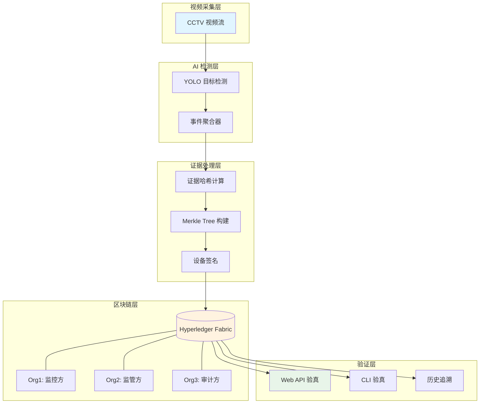

<div align="center">

# 🔐 SecureLens

**基于区块链的智能视频监控证据管理系统**

[](https://www.python.org/)
[](https://fastapi.tiangolo.com/)
[](https://www.hyperledger.org/use/fabric)
[](https://opensource.org/licenses/MIT)

*从视频检测到区块链存证的完整闭环解决方案*

🌐 **语言 / Language**: [中文](README.md) | [English](README.en.md)

[快速开始](#-快速开始) • [功能特性](#-核心功能) • [架构设计](#-系统架构) • [文档](#-文档)

</div>

## 📖 项目简介

SecureLens 是一个将 AI 视频分析与区块链技术深度融合的证据管理系统，实现从监控视频到可信存证的全流程自动化。

### 为什么选择 SecureLens？

- ✅ **不可篡改** - 基于 Hyperledger Fabric 区块链，证据一旦上链永久可追溯
- ✅ **高效批处理** - Merkle Tree 批量上链，降低链上存储成本
- ✅ **设备级签名** - ECDSA 数字签名确保证据来源可信
- ✅ **隐私保护** - 私有数据集合（PDC）保护敏感原始图像
- ✅ **实时检测** - YOLO 模型实时目标检测与智能事件聚合
- ✅ **多方协作** - 3 组织架构支持监控方、监管方、审计方协同工作

---

## 🎯 核心功能

<table>
<tr>
<td width="50%">

### 🎥 智能视频分析
- YOLO 实时目标检测（人、车辆等）
- 多帧跟踪与事件聚合
- 状态机管理：`pending → confirmed → closed`
- 自动生成证据快照与元数据

</td>
<td width="50%">

### 🔗 区块链存证
- Merkle Tree 批量上链（10秒窗口）
- 设备私钥 ECDSA 签名
- 双重背书策略（Org1 + Org2）
- 支持单条/批量两种上链模式

</td>
</tr>
<tr>
<td width="50%">

### ✅ 证据验真
- 链上 Merkle 证明验��
- 本地哈希一致性校验
- Web API + CLI 双重验真入口
- 完整历史记录追溯

</td>
<td width="50%">

### 🔒 隐私与审计
- 私有数据集合（PDC）保护原图
- 整改流程管理（创建/提交/确认）
- 跨组织审计轨迹导出
- 细粒度访问控制（ACL）

</td>
</tr>
<tr>
<td width="50%">

### 📋 工单管理（新）
- 完整工单生命周期管理
- 状态流转可视化
- 超期工单自动标记
- 多组织协同工作流

</td>
<td width="50%">

### 🎭 角色权限（新）
- 三组织角色切换（Org1/Org2/Org3）
- 动态权限控制
- 审计报告导出验证
- 自动触发工单机制

</td>
</tr>
</table>

---

## 🏗️ 系统架构



### 组织架构

| 组织 | 角色 | 权限 |
|------|------|------|
| **Org1** | 监控设备方 | 创建证据、提交整改、读取私有数据 |
| **Org2** | 监管方 | 创建证据、创建整改单、确认整改、读取私有数据 |
| **Org3** | 审计方 | 只读查询、导出审计轨迹 |

---

## 📁 项目结构

```
SecureLens/
├── 🐍 web_app.py              # FastAPI Web 服务 + 实时检测
├── ⚓ anchor_to_fabric.py     # 离线补链脚本
├── ✅ verify_evidence.py      # 命令行验真工具
├── ⚙️  config.py               # 统一配置管理
├── 📜 chaincode/
│   ├── chaincode.go           # Fabric 智能合约（Go）
│   └── collections_config.json # 私有数据集合配置
├── 🚀 scripts/
│   ├── stage3_setup_network.sh # 3 组织网络启动脚本
│   └── stage3_verify.sh        # 验收测试脚本
├── 📄 templates/
│   └── index.html             # Web 前端界面
├── 📋 .env.example            # 配置模板
└── 📚 docs/
    ├── FABRIC_RUNBOOK.md      # Fabric 运维手册
    └── EXECUTE_INSTRUCTIONS.md # 执行步骤说明
```

## 🚀 快速开始

> 💡 **新手推荐**：如果你是第一次使用本系统，请先阅读 [快速启动指南（阶段四）](QUICKSTART_PHASE4.md)，里面包含完整的演示流程和常见问题解答。

### 前置要求

- Python 3.10+
- Go 1.20+
- Docker & Docker Compose
- Hyperledger Fabric 2.x（通过 fabric-samples）

### 步骤 1️⃣：启动区块链网络

> ⚠️ **重要提示**：如果你之前已经启动过 Fabric 网络，需要先清理旧网络。详见 [Fabric 网络清理与重建指南](FABRIC_RESET_GUIDE.md)。

一键启动 3 组织 Fabric 网络：

```bash
cd /path/to/CCTV-W-FABRIC-main
./scripts/stage3_setup_network.sh
```

部署智能合约（带双重背书策略 + 私有数据集合）：

```bash
cd ~/projects/fabric-samples/test-network
./network.sh deployCC \
  -ccn evidence \
  -ccp /path/to/CCTV-W-FABRIC-main/chaincode \
  -ccl go \
  -ccep "AND('Org1MSP.peer','Org2MSP.peer')" \
  -cccg /path/to/CCTV-W-FABRIC-main/chaincode/collections_config.json
```

### 步骤 2️⃣：配置环境

复制配置模板并修改：

```bash
cp .env.example .env
```

关键配置项：

```bash
# Fabric 配置
FABRIC_SAMPLES_PATH=~/projects/fabric-samples
CHANNEL_NAME=mychannel
CHAINCODE_NAME=evidence

# 视频源（支持 RTSP/HTTP/本地文件）
VIDEO_SOURCE=https://cctv1.kctmc.nat.gov.tw/6e559e58/

# 设备签名密钥（用于证据签名）
DEVICE_CERT_PATH=device_keys/default/cert.pem
DEVICE_KEY_PATH=device_keys/default/key.pem
DEVICE_SIGNATURE_REQUIRED=true

# Merkle 批处理窗口（秒）
MERKLE_BATCH_WINDOW_SECONDS=10
```

### 步骤 3️⃣：安装依赖并启动

```bash
# 创建虚拟环境
python3 -m venv venv
source venv/bin/activate

# 安装依赖
pip install -r requirements.txt

# 启动 Web 服务
python -m uvicorn web_app:app --host 0.0.0.0 --port 8000
```

🎉 访问 **http://127.0.0.1:8000** 查看实时监控界面！

### 步骤 4️⃣：访问系统页面

- 🏠 **主页（视频监控）**: http://127.0.0.1:8000
- 📋 **工单管理**: http://127.0.0.1:8000/workorder
- 📊 **审计报告**: http://127.0.0.1:8000/audit
- ⚙️ **系统配置**: http://127.0.0.1:8000/config

> 💡 **提示**：如需 WebSocket 实时推送，安装 `pip install "uvicorn[standard]"`

---

## 🔍 使用指南

### 角色切换

在页面右上角选择组织角色：
- **Org1 - 监控方**：可提交整改、查看分配给自己的工单
- **Org2 - 监管方**：可创建工单、确认整改、查看所有工单
- **Org3 - 审计方**：只读查询、导出审计报告

角色选择会自动保存到浏览器本地存储。

### 工单管理流程

1. **创建工单**（Org2）：
   - 访问 `/workorder`，点击"创建工单"
   - 填写违规批次ID、整改要求、责任组织、截止日期
   - 提交后工单状态为"待整改"

2. **提交整改**（Org1）：
   - 切换到 Org1 角色
   - 找到分配给自己的工单，点击"提交整改"
   - 填写整改证明和附件链接
   - 提交后工单状态变为"待确认"

3. **确认整改**（Org2）：
   - 切换回 Org2 角色
   - 找到"待确认"的工单，点击"审核"
   - 填写审核意见，选择"通过"或"驳回"
   - 通过后工单状态变为"已关闭"

### Web 界面验真

在前端 **Blockchain Ledger** 区域输入 `event_id`，点击 **Verify** 按钮：

- ✅ **匹配** - 本地证据与链上数据一致
- ❌ **不匹配** - 证据可能被篡改
- ⚠️ **未上链** - 证据尚未提交到区块链

验证结果包含：
- 区块高度（Block Height）
- 批次 ID（Batch ID）
- 交易 ID（Transaction ID）
- 本地哈希 vs 链上哈希
- Merkle 证明根

### API 验真

```bash
# 验证单个事件
curl -X POST "http://127.0.0.1:8000/api/verify/event_1234567890_abc123"

# 查询历史记录
curl "http://127.0.0.1:8000/api/history/event_1234567890_abc123"
```

响应示例：

```json
{
  "status": "success",
  "mode": "merkle_batch",
  "match": true,
  "local_hash": "a1b2c3...",
  "chain_hash": "a1b2c3...",
  "batch_id": "batch_1234567890_1234567900_xyz",
  "merkle_root": "d4e5f6...",
  "tx_id": "abc123...",
  "block_number": 42
}
```

### 命令行验真

```bash
python3 verify_evidence.py event_1234567890_abc123
```

### 离线补链（批量处理历史证据）

```bash
# 单条模式（兼容旧流程）
python3 anchor_to_fabric.py --mode single --limit 20

# 批量签名模式（推荐）
python3 anchor_to_fabric.py --mode batch --batch-size 20 --limit 100

# 批量 + 私有数据写入
python3 anchor_to_fabric.py --mode batch --put-private --private-use-transient --batch-size 20 --limit 100

# 导出审计轨迹（Org3 身份）
python3 anchor_to_fabric.py --export-audit-batch batch_1234567890_1234567900_xyz
```

---

## 🔧 链码接口

### 证据管理

| 函数 | 说明 | 权限 |
|------|------|------|
| `CreateEvidence` | 创建单条证据（兼容模式） | Org1, Org2 |
| `CreateEvidenceBatch` | 批量创建证据（Merkle 模式） | Org1, Org2 |
| `ReadEvidence` | 读取证据详情 | Org1, Org2, Org3 |
| `VerifyEvidence` | 验证单条证据哈希 | Org1, Org2, Org3 |
| `VerifyEvent` | 验证 Merkle 证明 | Org1, Org2, Org3 |
| `GetHistoryForKey` | 查询完整历史 | Org1, Org2, Org3 |

### 私有数据管理

| 函数 | 说明 | 权限 |
|------|------|------|
| `PutRawEvidencePrivate` | 存储原始图像（PDC） | Org1, Org2 |
| `GetRawEvidencePrivate` | 读取原始图像 | Org1, Org2 |
| `GetRawEvidenceHash` | 读取图像哈希（公开） | Org1, Org2, Org3 |

### 整改流程

| 函数 | 说明 | 权限 |
|------|------|------|
| `CreateRectificationOrder` | 创建整改单 | Org2 |
| `SubmitRectification` | 提交整改材料 | Org1 |
| `ConfirmRectification` | 确认/拒绝整改 | Org2 |
| `QueryOverdueOrders` | 查询超期未完成工单 | Org1, Org2, Org3 |
| `ExportAuditTrail` | 导出审计轨迹 | Org1, Org2, Org3 |

---

## 🌐 REST API 接口

### 工单管理

| 接口 | 方法 | 说明 |
|------|------|------|
| `/api/workorder/create` | POST | 创建整改工单 |
| `/api/workorder/{id}/rectify` | POST | 提交整改证明 |
| `/api/workorder/{id}/confirm` | POST | 确认/驳回整改 |
| `/api/workorder/overdue` | GET | 查询超期工单 |
| `/api/workorder/{id}` | GET | 获取工单详情 |

### 审计报告

| 接口 | 方法 | 说明 |
|------|------|------|
| `/api/audit/export` | GET | 导出审计报告 |

### 系统配置

| 接口 | 方法 | 说明 |
|------|------|------|
| `/api/config/auto-workorder` | GET | 获取自动工单配置 |
| `/api/config/auto-workorder` | POST | 更新自动工单配置 |

### 证据验证

| 接口 | 方法 | 说明 |
|------|------|------|
| `/api/verify/{event_id}` | POST | 验证单个事件 |
| `/api/history/{event_id}` | GET | 查询历史记录 |

---

## 🧪 测试与验收

运行完整验收测试：

```bash
./scripts/stage3_verify.sh
```

测试覆盖：
- ✅ 单背书失败（预期行为）
- ✅ 双背书成功（Org1 + Org2）
- ✅ Org3 查询权限正常
- ✅ Org3 写入被拒（预期行为）
- ✅ PDC 可见性正确（Org1/Org2 可读，Org3 不可读）
- ✅ 设备签名验证通过
- ✅ Merkle 证明验证通过

运行 Go 链码单元测试：

```bash
cd chaincode && go test ./... -v
```

---

## 📚 文档

### 快速入门
- 🚀 [阶段四快速启动指南](QUICKSTART_PHASE4.md) - 5分钟快速上手，包含完整演示流程
- 🔄 [Fabric 网络清理与重建指南](FABRIC_RESET_GUIDE.md) - 网络重置、故障排查、快速脚本

### 详细文档
- 📘 [Fabric 运维手册](FABRIC_RUNBOOK.md) - 网络管理、链码部署、故障排查
- 📗 [执行步骤说明](EXECUTE_INSTRUCTIONS.md) - 详细操作指南
- 📕 [阶段四实施总结](PHASE4_SUMMARY.md) - 工单管理、角色权限、审计报告完整说明
- 📊 [阶段四完成报告](PHASE4_COMPLETION_REPORT.md) - 功能清单、性能指标、部署建议

### 变更记录
- 📙 [更新日志](CHANGELOG.md) - 版本历史与变更记录

---

## 🛠️ 技术栈

| 类别 | 技术 |
|------|------|
| **AI 检测** | YOLOv8, OpenCV, PyTorch |
| **Web 框架** | FastAPI, Jinja2, WebSocket |
| **区块链** | Hyperledger Fabric 2.x, Go Chaincode |
| **加密** | ECDSA (P-256), SHA-256, Merkle Tree |
| **存储** | LevelDB (Fabric), 本地文件系统 |

---

## 📊 性能指标

- **检测延迟**：< 100ms/帧（MPS 加速）
- **上链延迟**：~2-3 秒（批量模式）
- **批处理效率**：20 事件/批次，10 秒窗口
- **存储优化**：Merkle Tree 减少 95% 链上交易数

---

## 🤝 贡献指南

欢迎提交 Issue 和 Pull Request！

1. Fork 本仓库
2. 创建特性分支 (`git checkout -b feature/AmazingFeature`)
3. 提交更改 (`git commit -m 'Add some AmazingFeature'`)
4. 推送到分支 (`git push origin feature/AmazingFeature`)
5. 开启 Pull Request

---

## 📄 许可证

本项目采用 MIT 许可证 - 详见 [LICENSE](LICENSE) 文件

---

## 📮 联系方式

如有问题或建议，请通过以下方式联系：

- 📧 Email: [yyzbill1106@gmail.com](mailto:your-email@example.com)
- 🐛 Issues: [GitHub Issues](https://github.com/yourusername/SecureLens/issues)

---

<div align="center">

**⭐ 如果这个项目对你有帮助，请给个 Star！⭐**

Made with ❤️ by SecureLens Team

</div>
