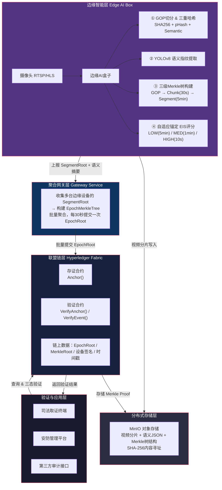

# 基于边缘AI与联盟链的监控视频防篡改解决方案

[](https://www.python.org/)
[](https://www.hyperledger.org/use/fabric)
[](https://github.com/ultralytics/ultralytics)
[](https://opensource.org/licenses/MIT)

> 一个结合边缘AI智能分析与区块链不可篡改特性的监控视频取证系统

[功能特性](#-功能特性) • [系统架构](#-系统架构) • [快速开始](#-快速开始) • [核心模块](#-核心模块) • [API文档](#-api文档) • [更新日志](CHANGELOG.md)

---

## 📖 项目简介

本项目实现了一套完整的监控视频防篡改解决方案，通过在边缘设备上部署AI模型进行实时视频分析，结合Hyperledger Fabric联盟链技术确保视频数据的完整性和可追溯性。系统采用三级Merkle树结构和自适应锚定策略，在保证安全性的同时大幅降低链上存储成本。

### 核心价值

- **防篡改保障**：视频哈希上链后不可篡改，提供法律级别的证据效力
- **智能分析**：边缘AI实时检测目标，自动提取语义指纹
- **成本优化**：自适应锚定策略根据场景重要性动态调整上链频率，降低95%链上交易
- **三态验证**：支持完整（INTACT）、转码（RE-ENCODED）、篡改（TAMPERED）三种验证结果
- **精确定位**：利用Merkle路径二分查找，可精确定位篡改时间点（精度1-2秒）

---

## ✨ 功能特性

### 🎥 边缘智能层

- **GOP级视频切分**：使用pyav库按GOP（Group of Pictures）切分视频流
- **三重哈希计算**：
  - 密码学哈希（SHA-256）：对GOP原始编码字节计算
  - 感知哈希（pHash）：对关键帧图像计算，容忍转码
  - 语义哈希（Semantic Hash）：YOLOv8提取目标类别计数
- **三级Merkle树**：GOP → Chunk(30s) → Segment(5min) 层级结构
- **自适应锚定（EIS）**：
  - 低活跃度（EIS < 0.3）：每5分钟上报
  - 中活跃度（0.3 ≤ EIS ≤ 0.7）：每1分钟上报
  - 高活跃度（EIS > 0.7）：每10秒上报

### 🌐 聚合网关层

- **多设备聚合**：支持多路视频流同时接入
- **Epoch Merkle树**：每30秒聚合所有设备的SegmentRoot
- **设备签名验证**：ECDSA数字签名确保数据来源可信
- **历史数据管理**：SQLite存储Merkle树结构和历史记录

### ⛓️ 联盟链层

- **Hyperledger Fabric**：单机Docker模拟多节点部署
- **智能合约**：
  - `AnchorContract`：存储EpochRoot和设备签名
  - `VerifyContract`：验证Merkle路径和哈希一致性
- **三态判定**：链下计算三态结果，链上只做Merkle验证

### 💾 分布式存储层

- **MinIO对象存储**：存储视频分片、语义JSON、Merkle树结构
- **内容寻址**：自行计算SHA-256作为CID实现内容寻址
- **数据持久化**：支持视频原始数据的长期存储和检索

---

## 🏗️ 系统架构



### 数据流程

**存证流程（实时运行）**

```
摄像头 → GOP切分 → 三重哈希 → YOLOv8语义提取 → EIS评分
  → 三级Merkle树 → MinIO存储 → SegmentRoot上报 → 网关聚合
  → EpochRoot → 上链
```

**验证流程（按需触发）**

```
验证请求 → MinIO拉取视频 → 重算哈希 → 获取Merkle路径
  → 链上验证 → 三态判定 → 二分定位篡改点
```

---

## 🚀 快速开始

### 环境要求

- **操作系统**：Linux / macOS
- **Python**：3.10+
- **Docker**：20.10+
- **Docker Compose**：1.29+
- **硬件**：建议8GB+ RAM，支持GPU加速（可选）

### 安装步骤

#### 1. 克隆项目

```bash
git clone https://github.com/NgokzittYu/CCTV-W-FABRIC.git
cd CCTV-W-FABRIC-main
```

#### 2. 安装Python依赖

```bash
# 创建虚拟环境（推荐）
python3 -m venv venv
source venv/bin/activate  # Windows: venv\Scripts\activate

# 安装依赖
pip install -r requirements.txt
```

#### 3. 启动MinIO存储

```bash
# 启动MinIO容器
docker run -d \
  -p 9000:9000 \
  -p 9001:9001 \
  --name minio \
  -e "MINIO_ROOT_USER=minioadmin" \
  -e "MINIO_ROOT_PASSWORD=minioadmin" \
  minio/minio server /data --console-address ":9001"

# 访问 http://localhost:9001 创建 bucket: video-evidence
```

#### 4. 启动Hyperledger Fabric网络

```bash
cd fabric-samples/test-network

# 启动网络
./network.sh up createChannel -ca -s couchdb

# 部署智能合约
./network.sh deployCC -ccn cctv -ccp ../../chaincode -ccl go

cd ../..
```

#### 5. 配置环境变量

创建 `.env` 文件：

```bash
# MinIO配置
MINIO_ENDPOINT=localhost:9000
MINIO_ACCESS_KEY=minioadmin
MINIO_SECRET_KEY=minioadmin
MINIO_BUCKET_NAME=video-evidence

# Fabric配置
FABRIC_SAMPLES_PATH=./fabric-samples
CHANNEL_NAME=mychannel
CHAINCODE_NAME=cctv

# AI模型配置
SEMANTIC_MODEL_PATH=yolov8n.pt
SEMANTIC_CONFIDENCE=0.5

# 视频源（可选，用于测试）
VIDEO_SOURCE=sample_videos/test.mp4
```

#### 6. 运行测试

```bash
# 测试GOP切分
python -m services.gop_splitter --file sample_videos/test.mp4

# 测试Merkle树构建
python -m pytest tests/test_hierarchical_merkle.py -v

# 测试自适应锚定
python -m pytest tests/test_adaptive_anchor.py -v

# 端到端验证测试
python -m pytest tests/test_gop_verification_e2e.py -v
```

#### 7. 启动服务

```bash
# 终端1: 启动网关服务
python gateway/gateway_service.py

# 终端2: 启动设备模拟器（测试用）
python gateway/simulate_devices.py

# 终端3: 运行视频检测（可选）
python detect.py --source sample_videos/test.mp4
```

---

## 📦 核心模块

### 1. GOP切分模块 (`services/gop_splitter.py`)

按GOP（Group of Pictures）切分视频流，提取关键帧和原始编码字节。

```python
from services.gop_splitter import split_gops

# 切分视频
gops = split_gops("video.mp4")

for gop in gops:
    print(f"GOP {gop.gop_id}: {gop.frame_count} frames, {gop.byte_size} bytes")
    print(f"SHA-256: {gop.sha256_hash}")
```

**关键特性**：
- 使用pyav库实现零拷贝GOP切分
- 同时提取关键帧图像供后续pHash和YOLO使用
- 记录完整元数据（时间戳、帧数、字节大小）

### 2. 三重哈希计算

#### 密码学哈希 (`services/crypto_utils.py`)

```python
from services.crypto_utils import compute_sha256

# 对GOP原始字节计算SHA-256
crypto_hash = compute_sha256(gop.raw_bytes)
```

#### 感知哈希 (`services/perceptual_hash.py`)

```python
from services.perceptual_hash import compute_phash

# 对关键帧计算pHash（容忍转码）
phash = compute_phash(gop.keyframe_image)
```

#### 语义哈希 (`services/semantic_fingerprint.py`)

```python
from services.semantic_fingerprint import SemanticFingerprint

# 使用YOLOv8提取语义指纹
semantic = SemanticFingerprint.from_image(
    gop.keyframe_image,
    gop_id=gop.gop_id
)
print(f"检测到: {semantic.total_count} 个目标")
print(f"类别分布: {semantic.class_counts}")
```

### 3. 三级Merkle树 (`services/merkle_utils.py`)

```python
from services.merkle_utils import HierarchicalMerkleTree

# 创建三级Merkle树
tree = HierarchicalMerkleTree()

# 添加GOP叶子节点
for gop in gops:
    combined_hash = crypto_hash + phash + semantic_hash
    tree.add_gop_leaf(gop.gop_id, combined_hash, gop.timestamp)

# 获取SegmentRoot（5分钟）
segment_root = tree.get_segment_root()
```

**树结构**：
```
SegmentRoot (5min)
├── ChunkRoot_0 (30s)
│   ├── GOP_0
│   ├── GOP_1
│   └── ...
├── ChunkRoot_1 (30s)
│   └── ...
└── ...
```

### 4. 自适应锚定 (`services/adaptive_anchor.py`)

根据场景活跃度动态调整上报频率。

```python
from services.adaptive_anchor import AdaptiveAnchor

anchor = AdaptiveAnchor(
    window_size=10,        # 滑动窗口大小
    upgrade_confirm=3,     # 升级确认次数
    downgrade_confirm=5    # 降级确认次数
)

# 处理每个GOP的语义指纹
decision = anchor.process(semantic)

if decision.should_report_now:
    print(f"触发上报: level={decision.level}, interval={decision.report_interval_seconds}s")
    # 上报SegmentRoot到网关
```

**EIS评分规则**：
- `total_count == 0` → EIS = 0.1（低活跃）
- `1 <= total_count <= 5` → EIS = 0.5（中活跃）
- `total_count > 5` → EIS = 0.9（高活跃）

**上报间隔**：
- LOW: 300秒（5分钟）
- MEDIUM: 60秒（1分钟）
- HIGH: 10秒

### 5. 网关服务 (`gateway/gateway_service.py`)

聚合多设备上报，构建EpochMerkleTree并上链。

```python
# 启动网关
python gateway/gateway_service.py

# API端点
POST /report  # 接收设备SegmentRoot上报
GET /health   # 健康检查
```

**网关功能**：
- 接收多设备SegmentRoot上报
- 每30秒构建EpochMerkleTree
- 提交EpochRoot到Fabric链
- SQLite存储历史记录

### 6. MinIO存储 (`services/minio_storage.py`)

```python
from services.minio_storage import MinIOStorage

storage = MinIOStorage()

# 上传GOP视频分片
cid = storage.upload_gop(gop.raw_bytes, gop.gop_id)

# 上传语义JSON
semantic_cid = storage.upload_semantic(semantic.to_json(), gop.gop_id)

# 下载验证
downloaded = storage.download_gop(cid)
```

### 7. 三态验证器 (`services/tri_state_verifier.py`)

```python
from services.tri_state_verifier import TriStateVerifier, VerificationResult

verifier = TriStateVerifier(
    phash_threshold=10  # Hamming距离阈值
)

# 验证GOP
result = verifier.verify_gop(
    original_crypto_hash=original_hash,
    original_phash=original_phash,
    current_crypto_hash=current_hash,
    current_phash=current_phash
)

if result == VerificationResult.INTACT:
    print("✅ 完整：未被篡改")
elif result == VerificationResult.RE_ENCODED:
    print("⚠️ 转码：内容未变但编码格式改变")
elif result == VerificationResult.TAMPERED:
    print("❌ 篡改：内容已被修改")
```

---

## 🔧 API文档

### 网关API

#### 1. 提交SegmentRoot上报

```http
POST /report
Content-Type: application/json

{
  "device_id": "cam_001",
  "segment_root": "abc123...",
  "timestamp": "2024-03-16T10:30:00Z",
  "semantic_summaries": [
    "检测到3辆车",
    "检测到2个行人"
  ],
  "gop_count": 150
}
```

**响应**：
```json
{
  "status": "success",
  "message": "Report received",
  "device_id": "cam_001"
}
```

#### 2. 健康检查

```http
GET /health
```

**响应**：
```json
{
  "status": "healthy",
  "timestamp": "2024-03-16T10:30:00Z"
}
```

### 智能合约API

#### 1. 存储EpochRoot

```go
// 调用AnchorContract
peer chaincode invoke -C mychannel -n cctv \
  -c '{"function":"StoreEpochRoot","Args":["epoch_001","root_hash","signature"]}'
```

#### 2. 验证Merkle路径

```go
// 调用VerifyContract
peer chaincode query -C mychannel -n cctv \
  -c '{"function":"VerifyMerklePath","Args":["epoch_001","gop_hash","merkle_path"]}'
```

---

## 🧪 测试

### 单元测试

```bash
# 测试所有模块
python -m pytest tests/ -v

# 测试特定模块
python -m pytest tests/test_adaptive_anchor.py -v
python -m pytest tests/test_hierarchical_merkle.py -v
python -m pytest tests/test_tri_state_verifier.py -v
```

### 集成测试

```bash
# 端到端GOP验证测试
python -m pytest tests/test_gop_verification_e2e.py -v

# 自适应锚定集成测试
python -m pytest tests/test_anchor_integration.py -v

# Epoch Merkle树测试
python -m pytest tests/test_epoch_merkle.py -v
```

### 性能测试

```bash
# 测试GOP切分性能
python -m services.gop_splitter --file large_video.mp4 --benchmark

# 测试Merkle树构建性能
python tests/benchmark_merkle.py
```

---

## 📊 性能指标

### 边缘设备性能

- **GOP切分速度**：实时处理1080p@30fps视频流
- **YOLOv8-nano推理**：~15ms/帧（GPU），~50ms/帧（CPU）
- **Merkle树构建**：<10ms（1000个GOP）
- **内存占用**：~500MB（包含模型）

### 网关性能

- **并发设备数**：支持10+设备同时上报
- **Epoch构建时间**：<100ms（10设备）
- **SQLite写入速度**：1000+ TPS

### 区块链性能

- **交易吞吐量**：~100 TPS（单机Docker）
- **区块确认时间**：~2秒
- **存储优化**：相比逐GOP上链减少95%交易数

---

## 🛠️ 配置说明

### 环境变量

| 变量名 | 默认值 | 说明 |
|--------|--------|------|
| `MINIO_ENDPOINT` | `localhost:9000` | MinIO服务地址 |
| `MINIO_ACCESS_KEY` | `minioadmin` | MinIO访问密钥 |
| `MINIO_SECRET_KEY` | `minioadmin` | MinIO密钥 |
| `MINIO_BUCKET_NAME` | `video-evidence` | 存储桶名称 |
| `FABRIC_SAMPLES_PATH` | `./fabric-samples` | Fabric网络路径 |
| `CHANNEL_NAME` | `mychannel` | 通道名称 |
| `CHAINCODE_NAME` | `cctv` | 智能合约名称 |
| `SEMANTIC_MODEL_PATH` | `yolov8n.pt` | YOLO模型路径 |
| `SEMANTIC_CONFIDENCE` | `0.5` | 检测置信度阈值 |
| `PHASH_HAMMING_THRESHOLD` | `10` | pHash相似度阈值 |

### 自适应锚定配置

```python
# config.py
ADAPTIVE_ANCHOR_CONFIG = {
    "window_size": 10,           # 滑动窗口大小
    "upgrade_confirm": 3,        # 升级确认次数（快升）
    "downgrade_confirm": 5,      # 降级确认次数（慢降）
    "low_threshold": 0.3,        # 低活跃度阈值
    "high_threshold": 0.7,       # 高活跃度阈值
    "interval_low": 300,         # 低活跃上报间隔（秒）
    "interval_medium": 60,       # 中活跃上报间隔（秒）
    "interval_high": 10          # 高活跃上报间隔（秒）
}
```

---

## 🔍 故障排查

### 常见问题

#### 1. MinIO连接失败

```bash
# 检查MinIO容器状态
docker ps | grep minio

# 查看日志
docker logs minio

# 重启容器
docker restart minio
```

#### 2. Fabric网络启动失败

```bash
# 清理旧网络
cd fabric-samples/test-network
./network.sh down

# 清理Docker卷
docker volume prune

# 重新启动
./network.sh up createChannel -ca -s couchdb
```

#### 3. YOLO模型加载失败

```bash
# 手动下载模型
wget https://github.com/ultralytics/assets/releases/download/v0.0.0/yolov8n.pt

# 或使用国内镜像
pip install ultralytics -i https://pypi.tuna.tsinghua.edu.cn/simple
```

#### 4. GOP切分失败

```bash
# 检查视频文件格式
ffprobe video.mp4

# 确保安装了pyav
pip install av

# 测试切分
python -m services.gop_splitter --file video.mp4 --debug
```

---

## 📚 项目结构

```
CCTV-W-FABRIC-main/
├── chaincode/                  # 智能合约（Go）
│   ├── chaincode.go           # 主合约逻辑
│   ├── chaincode_test.go      # 合约测试
│   └── go.mod
├── services/                   # 核心服务模块
│   ├── gop_splitter.py        # GOP切分
│   ├── crypto_utils.py        # 密码学哈希
│   ├── perceptual_hash.py     # 感知哈希
│   ├── semantic_fingerprint.py # 语义指纹
│   ├── merkle_utils.py        # Merkle树工具
│   ├── adaptive_anchor.py     # 自适应锚定
│   ├── minio_storage.py       # MinIO存储
│   ├── tri_state_verifier.py  # 三态验证
│   ├── gop_verifier.py        # GOP验证器
│   ├── gateway_service.py     # 网关服务
│   └── fabric_client.py       # Fabric客户端
├── gateway/                    # 网关层
│   ├── gateway_service.py     # 网关主服务
│   ├── simulate_devices.py    # 设备模拟器
│   ├── README.md              # 网关文档
│   └── README_CN.md
├── tests/                      # 测试文件
│   ├── test_gop_splitter.py
│   ├── test_hierarchical_merkle.py
│   ├── test_adaptive_anchor.py
│   ├── test_tri_state_verifier.py
│   ├── test_gop_verification_e2e.py
│   └── ...
├── sample_videos/              # 测试视频
├── config.py                   # 配置文件
├── detect.py                   # 视频检测脚本
├── verify_evidence.py          # 证据验证脚本
├── requirements.txt            # Python依赖
└── README.md                   # 本文档
```

---

## 🗺️ 开发路线图

### ✅ 已完成（MVP）

- [x] GOP级视频切分
- [x] 三重哈希计算（SHA-256 + pHash + Semantic）
- [x] 三级Merkle树（GOP → Chunk → Segment）
- [x] 自适应锚定（EIS评分）
- [x] MinIO分布式存储
- [x] 网关聚合服务
- [x] Fabric智能合约
- [x] 三态验证器
- [x] 端到端测试

### 🚧 进行中

- [ ] Web管理界面
- [ ] 实时视频流处理
- [ ] 设备私钥签名机制
- [ ] 审计合约（AuditContract）

### 📋 计划中

- [ ] IPFS集群部署（替代MinIO）
- [ ] 深度感知哈希（MobileNetV3 + LSH）
- [ ] RTP字节级GOP切分
- [ ] 完整版EIS（光流 + 异常检测）
- [ ] 多链互操作
- [ ] 移动端验证APP

---

## 🤝 贡献指南

欢迎提交Issue和Pull Request！

### 贡献流程

1. Fork本仓库
2. 创建特性分支 (`git checkout -b feature/AmazingFeature`)
3. 提交更改 (`git commit -m 'Add some AmazingFeature'`)
4. 推送到分支 (`git push origin feature/AmazingFeature`)
5. 开启Pull Request

### 代码规范

- 遵循PEP 8 Python代码风格
- 添加必要的注释和文档字符串
- 编写单元测试覆盖新功能
- 更新相关文档

---

## 📄 许可证

本项目采用 MIT 许可证 - 详见 [LICENSE](LICENSE) 文件

---

## 📮 联系方式

- **作者**：NgokzittYu
- **邮箱**：yyzbill1106@gmail.com
- **项目地址**：https://github.com/NgokzittYu/CCTV-W-FABRIC

---

## 📝 更新日志

### v1.0.0 (2026-03-16)

**初始版本发布**

- ✅ 实现边缘AI视频分析模块（YOLOv8）
- ✅ 实现三级Merkle树结构（GOP → Chunk → Segment）
- ✅ 实现自适应锚定策略（EIS评分）
- ✅ 实现聚合网关层（Epoch Merkle树）
- ✅ 集成Hyperledger Fabric联盟链
- ✅ 集成MinIO分布式存储
- ✅ 实现三态验证系统（INTACT/RE-ENCODED/TAMPERED）
- ✅ 完成端到端测试和文档

---

## 🙏 致谢

- [Hyperledger Fabric](https://www.hyperledger.org/use/fabric) - 企业级区块链框架
- [Ultralytics YOLOv8](https://github.com/ultralytics/ultralytics) - 实时目标检测
- [PyAV](https://github.com/PyAV-Org/PyAV) - Python视频处理
- [MinIO](https://min.io/) - 高性能对象存储
- [ImageHash](https://github.com/JohannesBuchner/imagehash) - 感知哈希库

---

<div align="center">

**⭐ 如果这个项目对你有帮助，请给个Star！⭐**

Made with ❤️ by NgokzittYu

</div>
