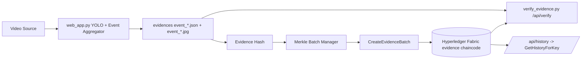

# SecureLens: CCTV -> Fabric Trusted Evidence Pipeline

[](https://www.python.org/)
[](https://fastapi.tiangolo.com/)
[](https://www.hyperledger.org/use/fabric)
[](https://opensource.org/licenses/MIT)

SecureLens 提供一个完整闭环：视频检测、证据哈希、Merkle 批量上链、链下验真、链上历史追溯。

## 当前真实架构



## 功能清单

- 目标检测与事件聚合：`pending -> confirmed -> closed`
- 证据哈希标准化：排除 `_anchor`、`_merkle`、`evidence_hash`、`evidence_hash_list`
- Merkle 批量上链：一个批次写入一个 `merkle_root`，同时写入事件键映射
- 链下验真：支持 CLI 与 Web API 验真
- 链上审计：支持 `GetHistoryForKey` 全量历史查询

## 项目结构

- `web_app.py`：Web 服务、实时检测、Merkle 批处理与上链
- `anchor_to_fabric.py`：离线单条证据上链脚本（`CreateEvidence`）
- `verify_evidence.py`：本地证据与链上哈希一致性校验
- `chaincode/chaincode.go`：`evidence` 链码实现
- `config.py`：统一配置加载（读取 `.env`）
- `.env.example`：配置模板
- `FABRIC_RUNBOOK.md`：Fabric 运维操作手册
- `EXECUTE_INSTRUCTIONS.md`：执行步骤说明

## 快速启动

### 1) 部署链码

```bash
cd ~/projects/fabric-samples/test-network
./network.sh down
./network.sh up createChannel -c mychannel -ca
./network.sh deployCC -ccn evidence -ccp /ABS/PATH/TO/CCTV-W-FABRIC-main/chaincode -ccl go
```

### 2) 配置项目

```bash
cd /ABS/PATH/TO/CCTV-W-FABRIC-main
cp .env.example .env
```

至少校对以下项：

```dotenv
FABRIC_SAMPLES_PATH=~/projects/fabric-samples
CHANNEL_NAME=mychannel
CHAINCODE_NAME=evidence
EVIDENCE_DIR=evidences
VIDEO_SOURCE=https://cctv1.kctmc.nat.gov.tw/6e559e58/
```

### 3) 安装依赖并启动

```bash
python3 -m venv venv
source venv/bin/activate
pip install -r requirements.txt
uvicorn web_app:app --host 0.0.0.0 --port 8000
```

访问：`http://127.0.0.1:8000`

## 验真与追溯

```bash
# 验真
curl -X POST "http://127.0.0.1:8000/api/verify/event_xxx"

# 查询历史
curl "http://127.0.0.1:8000/api/history/event_xxx"

# 命令行验真
python3 verify_evidence.py event_xxx
```

## 离线补链（可选）

```bash
python3 anchor_to_fabric.py --dry-run --limit 5
python3 anchor_to_fabric.py --limit 20
```

## 更新日志

- 2026-03-04：完成阶段一规范化，新增 `.env` 配置体系（含 `config.py`/`.env.example`），移除核心硬编码；新增 `requirements.txt` 与 `LICENSE`；同步 `FABRIC_RUNBOOK.md`、`EXECUTE_INSTRUCTIONS.md`，并补充阶段一自检脚本 `scripts/check_stage1.sh`。

## 文档

- [FABRIC_RUNBOOK.md](FABRIC_RUNBOOK.md)
- [EXECUTE_INSTRUCTIONS.md](EXECUTE_INSTRUCTIONS.md)
- [CHANGELOG.md](CHANGELOG.md)

## 自检

```bash
./scripts/check_stage1.sh
```

## License

This project is licensed under the MIT License. See [LICENSE](LICENSE).
