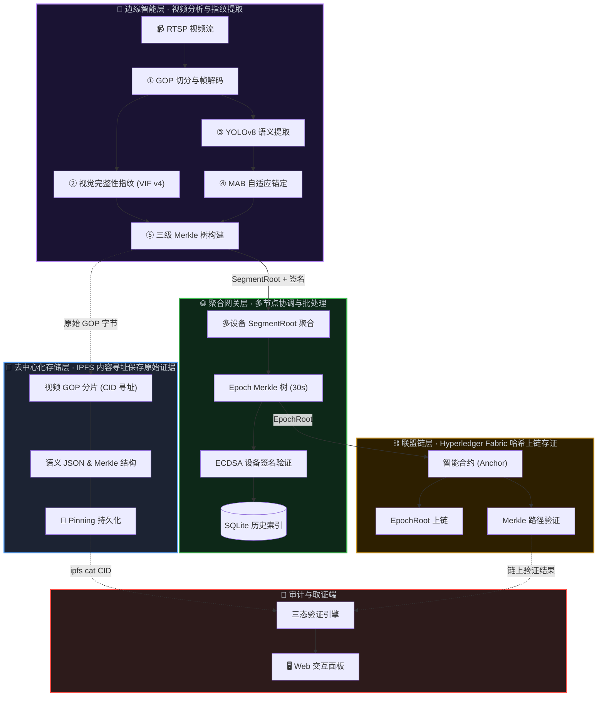

# 基于边缘AI与联盟链的监控视频防篡改解决方案
(SecureLens: Video Integrity Verification System)

> 一个结合边缘 AI 智能分析与区块链不可篡改特性的监控视频取证系统

[项目简介](#-项目简介) • [功能特性](#-功能特性) • [安装使用](docs/GETTING_STARTED.md) • [文档库](docs/GETTING_STARTED.md) • [📝 版本更新](CHANGELOG.md)

SecureLens 利用边缘设备上的 AI 模型对监控视频进行实时语义与特征提取，并结合 Hyperledger Fabric 联盟链技术实现防篡改和快速审计。在保证司法级证据效力的同时，通过轻量级视觉完整性指纹（VIF v4）和基于强化学习（MAB）的自适应上链策略，降低了 95% 的链上存储成本。

---

## 📚 快速导航

- **[安装与快速开始指南](docs/GETTING_STARTED.md)**：环境配置、启动网络、API 文档、故障排查
- **[📝 版本更新](CHANGELOG.md)**：了解最近架构演进与修复历史

---

## 📖 项目简介

本项目实现了一套完整的监控视频防篡改解决方案，通过在边缘设备上部署AI模型进行实时视频分析，结合Hyperledger Fabric联盟链技术确保视频数据的完整性和可追溯性。系统采用三级Merkle树结构、轻量视觉完整性指纹（VIF v4）和基于Multi-Armed Bandit的自适应锚定策略，在保证安全性的同时大幅降低链上存储成本。

### 核心价值

- **防篡改保障**：视频哈希上链后不可篡改，提供法律级别的证据效力
- **智能分析**：边缘AI实时检测目标，自动提取语义指纹
- **成本优化**：自适应锚定策略根据场景重要性动态调整上链频率，降低95%链上交易
- **宽容态初筛**：VIF v4 纯视觉指纹支持三态输出（INTACT / RE_ENCODED / TAMPERED_SUSPECT），默认宽容模式优先保证合法转码零误伤，高危告警仅作为粗粒度高门限拦截信号，细粒度篡改终判全权交由下游 MAB 语义管线。
- **精确定位**：利用Merkle路径二分查找，可精确定位篡改时间点（精度1-2秒），后续交由 MAB 锚定链路及对象模型细粒度校验。

---

## ✨ 功能特性

### 🎥 边缘智能层

- **GOP级视频切分**：使用 pyav 库按 GOP（Group of Pictures）切分视频流
- **双哈希计算**：
  - 密码学哈希（SHA-256）：对 GOP 原始编码字节计算
  - 深度感知哈希（Deep pHash）：MobileNetV3-Small + LSH 压缩为 64-bit 指纹
- **轻量视觉完整性指纹（VIF v4）**：
  - GOP 关键帧 + 确定性采样帧 → MobileNetV3 CNN Embedding → Mean Pooling
  - LSH 投影到 256-bit (64 Hex) 固定位宽，彻底去除时序光流与语义耦合
- **三级 Merkle 树**：GOP → Chunk(30s) → Segment(5min) 层级结构
- **自适应锚定 (MAB)**：
  - UCB1 / Thompson Sampling 策略，动态学习最优锚定间隔（每 1/2/5/10 个 GOP）

### 🌐 聚合网关层

- **多设备聚合**：支持多路视频流同时接入
- **Epoch Merkle 树**：每 30 秒聚合所有设备的 SegmentRoot
- **设备签名验证**：ECDSA 数字签名确保数据来源可信
- **历史数据管理**：SQLite 存储 Merkle 树结构和历史记录

### ⛓️ 联盟链层

- **Hyperledger Fabric**：单机 Docker 模拟多节点部署
- **智能合约**：存储 EpochRoot，验证 Merkle 路径和哈希一致性
- **三态判定**：链下计算三态结果，链上只做 Merkle 验证

### 💾 去中心化存储层

- **IPFS 内容寻址存储**：存储视频分片、语义 JSON、Merkle 树结构
- **原生 CID**：IPFS CIDv1 (SHA-256 multihash) 实现协议层内容寻址与完整性保证

---

## 🏗️ 核心系统架构

系统分为四个核心层：**边缘智能层**（视频分析与指纹提取）、**聚合网关层**（多节点协调与批处理）、**去中心化存储层**（IPFS 内容寻址保存原始证据）、以及**联盟链层**（Hyperledger Fabric 哈希上链存证）。

---

## 🔬 核心技术一：轻量视觉完整性指纹 (VIF v4)

传统的视频哈希（如 SHA-256）对像素变化极其敏感，合法的视频转码或压缩会导致哈希彻底改变，从而产生极高的误报率（False Positive）。

在 GOP 级视频存证管线中，为了解决重压制造成的证据失效问题，系统引入了**视觉完整性指纹（Video Integrity Fingerprint, VIF）作为宽容前置筛分模块**。经过 v2.1 → v4 的多轮消融实验与架构收敛，VIF 已从最初的三模态融合方案（感知 + 语义 + 时序光流）精简为**纯视觉内容级 GOP 指纹**。该模块支持三态输出接口，默认宽容模式优先保证各类网络环境下合法业务转码的 0 误伤容忍，不再承担细粒度的同源局部篡改终判职责，仅作为粗粒度高门限告警信号。系统定义的三种验证态接口如下：
1. **无修改 (INTACT)**：原始 GOP 字节 SHA-256 完全一致。
2. **合法转码 (RE_ENCODED)**：CRF 变化、H.264→H.265 转码、分辨率调整等不改变核心语义的操作。
3. **高危嫌疑 (TAMPERED_SUSPECT)**：VIF 距离击穿宽容阈值，API 兼容返回 `TAMPERED`，但系统层面明确定位为**高危疑似建议**，非终判，细粒度确认交由下游 MAB 语义管线。

### 🆚 核心演进：VIF v4 vs 初代方案

| 维度 | 初代方案 (密码学哈希 + 单体感知) | 当前 VIF v4 (纯视觉 Mean Pooling) | 解决的核心问题 |
| --- | --- | --- | --- |
| **容忍合法操作** | 极差。任何合法的转码、压缩、水印均导致哈希雪崩。 | **极高**。基于 Hamming 距离 + 数据驱动阈值（0.35）支持宽容三态验证。 | **解决了"合法转码导致证据失效"的强侵入性误报问题**。 |
| **计算负担** | 低（仅 SHA-256），但无鲁棒性。 | **轻量**。去除光流与语义分支后，单次 VIF 计算仅需 MobileNetV3 前向推理 + Mean Pooling。 | 消除了 Farneback 光流的算力黑洞，边缘设备可实时运行。 |
| **架构纯粹性** | 单点依赖，易被轻微操作掩盖。 | **纯视觉聚焦**。对 GOP 内多帧做 Mean Pooling，兼顾帧间一致性与全局画面特征。 | 避免多模态耦合带来的噪音放大与维护复杂度。 |

### VIF v4 算法原理解析

VIF v4 采用纯视觉 CNN Embedding + Mean Pooling 架构：

#### 1. 🎬 GOP 多帧确定性采样
- 输入一个 GOP 的关键帧（I 帧）及确定性采样帧（默认额外抽 1 帧，锁定在 `total // 2` 帧位）。
- 采样策略使用整数绝对索引，彻底消除跨平台浮点步长带来的 Hash 漂移。
- 保证 VIF 对整个 GOP 片段背书，而非退化为单帧封面指纹。

#### 2. 👁️ 视觉特征提取
- **模型**：`MobileNetV3-Small`（预训练权重，`classifier=Identity()`）。
- **输出**：全局平均池化后的 576 维特征向量。
- **特性**：捕捉整图色调、纹理与全局布局；对合法 CRF 重压缩、细微光照变化具有较强抗性；对大面积像素篡改（帧替换、高强度噪声、目标遮挡）高度敏感。

#### 3. 🧮 Mean Pooling 聚合
- 对 GOP 内所有采样帧的 576d 特征向量进行**均值池化**，得到单一聚合特征向量。
- L2 归一化后送入 LSH 投影层。

#### 4. 🔑 LSH 降维投影
- 确定性种子（seed=42）生成 256×576 随机高斯投影矩阵。
- 投影后二值化输出 **256-bit (64 Hex)** 定宽指纹，严格冻结协议位宽。

### 三态判定 (Tri-State Verification)

VIF v4 的三态验证逻辑大幅简化，消除了多模态分数权重耦合：

$$ Risk = \frac{HammingDistance(VIF_{orig},\ VIF_{curr})}{256} $$

- **INTACT (完整) ✅**：原始 SHA-256 完美匹配，无需比对 VIF。
- **RE_ENCODED (合法转码) ⚠️**：SHA-256 不匹配，但 $Risk < 0.35$（数据驱动的 P99 包络阈值）。系统判定为合法画质降低。
- **TAMPERED_SUSPECT (高危嫌疑) ❌**：$Risk \ge 0.35$。API 兼容返回 `TAMPERED`，但 `state_desc` 明确标记为 `TAMPERED_SUSPECT`，坚守非终判职权。细粒度同源微小篡改检测全权交由下游 MAB 语义验证管线与对象检测网络。

> **架构降级背景**：经 Phase 3 消融实验证实，在真实高动态视频和极重压缩场景下，底层视觉与时序光流对重度马赛克的敏感放大使得 VIF 完全无法具备细粒度微小同源抽帧篡改的判断依据（0.004% 影响完全掩埋在 0.320 正常衰减噪声中）。因此 v4 将原多模态融合方案收敛为纯视觉宽容护城河，时序与语义的细粒度检测责任全面下放至对象模型和 MAB 锚定深检管线。

---

## 🤖 核心技术二：MAB 强化学习自适应上链

如果将监控摄像头产生的所有视频哈希都无差别存入 Hyperledger Fabric 联盟链，将产生不可接受的 TPS 压力与存储成本。但在夜间或死角等长时间无事件发生的场景中，高频上链毫无意义。

本项目在边缘端引入了**多臂老虎机 (Multi-Armed Bandit, MAB)** 辅助决策系统。

### 🆚 核心演进：MAB 动态闭环 vs 初代静态 EIS (事件重要性评分)

| 维度 | 初代方案 (静态规则 EIS) | 当前 MAB (强化学习自适应) | 解决的核心问题 |
| --- | --- | --- | --- |
| **决策模式** | **静态开环**。人工硬编码 If-Else 规则阈值（如检测到 >5 人，则每10秒上链）。 | **动态闭环**。基于 MAB Agent 实时学习，从 4 个频率臂 [1, 2, 5, 10] GOP 中智能选择。 | **解决了人为拍脑门定阈值的系统僵化难题，实现自适应场景变化**。 |
| **参考指标** | 单一维度。仅仅判断当前画面的"场景活跃度"。 | **多目标权衡**。每次上链不仅看活跃度，更参考**验证成功率、交易 Gas 成本、网络延迟**。 | 静态规则无视链上拥堵（即便 TPS 暴雷依然按规则狂发），MAB 会随网络退让。 |
| **迭代效果** | 维护成本高，换一个摄像头环境就需要重新标定最优的时间阈值。 | **无需调参**。UCB1/Thompson 算法通过 Explore & Exploit 始终能自动优化成本效益比。 | **解决了海量边缘节点部署时的参数定制成本，最高可压降 95% 链上开销**。 |

### 动态锚定引擎 (Adaptive Anchor)

边缘 AI (YOLO) 解析当前监控画面的目标活跃度（EIS: Event Importance Score）。基于 EIS，系统动态调整将 Merkle 树 SegmentRoot 推送上链的频率（称之为：挂锚点 Anchor）。

- **可选策略臂 (Arms)**：包含 `[每 1 GOP, 每 2 GOP, 每 5 GOP, 每 10 GOP]` 锚定一次四种频率。
- **UCB1 / Thompson Sampling**：系统通过实时探索与利用（Explore & Exploit）。当场景中发生高价值事件（如大量人群聚集），模型算法不仅调高锚定频率（每 1 GOP上链一次，约延迟1秒），并惩罚低频臂；反之在空闲时，选择最低频臂（每 10 GOP 上链一次）降低成本。
- **成果**：在保证安全审计实时性的同时，可节约 **90% - 95%** 的区块链读写与存储开销。

---

## 📝 版本更新

### v3.0.1 (2026-04-25)
✅ GitHub 最新同步补录：确认 `sensor` 分支最新提交为 `ebdcca9`
✅ 大文件治理：忽略 benchmark 视频、运行数据库、日志、PID、ring buffer 等本地产物
✅ 仓库瘦身：移除已跟踪的 `.mp4` 与 `data/` 运行文件，避免 push 上传 GB 级对象
✅ 文档同步：补充 `CHANGELOG.md` 最近架构演进说明

### v3.0.0 (2026-04-08)
✅ 产品化重构：从 7 模块技术展板升级为双角色全栈应用
✅ 管理方后台：监控总览、设备管理、视频存证、告警中心
✅ 验证方平台：证据验真、验真报告、历史记录
✅ 真实后端闭环：视频上传 → GOP 切分 → VIF/SHA-256 → Merkle Root → Fabric 锚定 → SQLite 索引
✅ 新增一键脚本：服务启动、停止、状态检查

### v2.0.0 (2026-04-05)
✅ `demo2/` React + Vite 交互式演示系统上线
✅ 覆盖系统概览、边缘智能、聚合网关、IPFS、联盟链、审计验证、对比实验 7 个模块
✅ 新增统一设计系统、玻璃卡片、状态标签、动画计数器和模块化导航
✅ 接入 Lucide React、Recharts、Framer Motion 等前端依赖

### v1.5.0 (2026-03-30)
✅ 存储层升级：MinIO → IPFS 去中心化内容寻址存储
✅ CID 即完整性证明：存储/索引/验证三位一体
✅ 3 节点 IPFS Kubo 集群部署方案

### v1.4.1 (2026-03-28)
✅ VIF v4 架构收敛：彻底去除时序光流与语义耦合，收敛为纯视觉 Mean Pooling 指纹
✅ 三态验证简化：消除多模态权重，单一 Hamming 距离 + 数据驱动阈值 0.35
✅ GOP 采样确定性：整数绝对索引替代浮点步长，消除跨平台 Hash 漂移
✅ TAMPERED → TAMPERED_SUSPECT 语义降格：坚守非终判职权

### v1.4.0 (2026-03-24 ~ 2026-03-25)
✅ 时序来源标记辅助分析：引入编码域信号辅佐三态分类判断
✅ 交互式可视化：前端 Merkle 树动态交互与哈希完整下钻显示
✅ 架构重构：Demo 重签发管线与 VIF 算法三模态解耦

### v1.3.0 (2026-03-23)
✅ 多模态融合指纹 VIF：感知哈希 + 语义特征 + 时序光流 → 256 位融合指纹
✅ MAB 自适应锚定：UCB1 / Thompson Sampling 动态学习最优锚定间隔

### v1.2.0 (2026-03-23)
✅ 完整版 EIS：光流运动分析 + 统计异常检测 + 规则引擎加权融合
✅ 深度感知哈希升级：MobileNetV3-Small + LSH 压缩

### v1.1.0 (2026-03-16 ~ 2026-03-17)
✅ 语义指纹与组合验证
✅ 网关聚合服务（EpochMerkleTree）
✅ 自适应锚定模块（EIS 评分）
✅ GOP 验证与三态验证器
✅ 篡改检测演示脚本

### v1.0.0 (2026-03-13 ~ 2026-03-15)
✅ GOP 级视频切分 + 三重哈希计算
✅ Merkle 树类封装（序列化 + 证明）
✅ IPFS 去中心化存储集成
✅ Fabric 智能合约（Anchor / VerifyAnchor）
✅ 端到端测试

> 完整更新日志见 [CHANGELOG.md](CHANGELOG.md)

---

## ⚖️ License

MIT License. See `LICENSE` for more information.
