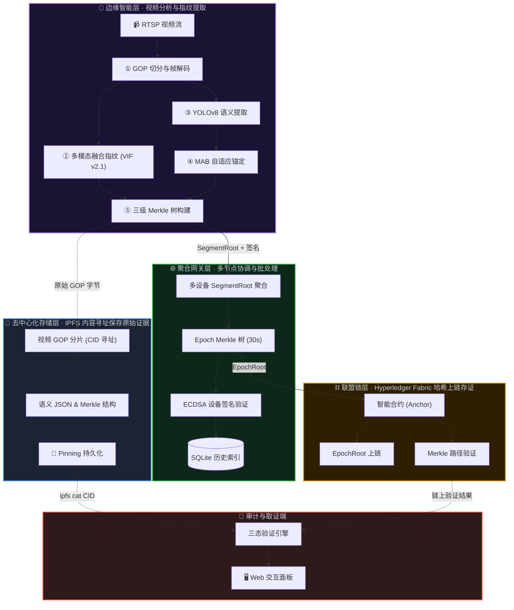

# 基于边缘AI与联盟链的监控视频防篡改解决方案
(SecureLens: Video Integrity Verification System)

> 一个结合边缘 AI 智能分析与区块链不可篡改特性的监控视频取证系统

[项目简介](#-项目简介) • [功能特性](#-功能特性) • [安装使用](docs/GETTING_STARTED.md) • [文档库](docs/GETTING_STARTED.md) • [📝 版本更新](CHANGELOG.md)

SecureLens 利用边缘设备上的 AI 模型对监控视频进行实时语义与特征提取，并结合 Hyperledger Fabric 联盟链技术实现防篡改和快速审计。在保证司法级证据效力的同时，通过多模态融合视频指纹（VIF）和基于强化学系（MAB）的自适应上链策略，降低了 95% 的链上存储成本。

---

## 📚 快速导航

- **[安装与快速开始指南](docs/GETTING_STARTED.md)**：环境配置、启动网络、API 文档、故障排查
- **[📝 版本更新](CHANGELOG.md)**：了解最近架构演进与修复历史

---

## 📖 项目简介

本项目实现了一套完整的监控视频防篡改解决方案，通过在边缘设备上部署AI模型进行实时视频分析，结合Hyperledger Fabric联盟链技术确保视频数据的完整性和可追溯性。系统采用三级Merkle树结构、多模态融合视频指纹（VIF）和基于Multi-Armed Bandit的自适应锚定策略，在保证安全性的同时大幅降低链上存储成本。

### 核心价值

- **防篡改保障**：视频哈希上链后不可篡改，提供法律级别的证据效力
- **智能分析**：边缘AI实时检测目标，自动提取语义指纹
- **成本优化**：自适应锚定策略根据场景重要性动态调整上链频率，降低95%链上交易
- **宽容态初筛**：支持初筛三态（INTACT 完整 / RE-ENCODED 合法转码 / TAMPERED 恶意篡改）输出接口，默认工作模式优先保证合法压缩与画质降低的容忍，高级异常告警仅作为粗粒度高门限拦截信号。
- **精确定位**：利用Merkle路径二分查找，可精确定位篡改时间点（精度1-2秒），后续交由 MAB 锚定链路及对象模型细粒度校验。

---

## ✨ 功能特性

### 🎥 边缘智能层

- **GOP级视频切分**：使用 pyav 库按 GOP（Group of Pictures）切分视频流
- **多模态哈希计算**：
  - 密码学哈希（SHA-256）：对 GOP 原始编码字节计算
  - 深度感知哈希（Deep pHash）：MobileNetV3-Small + LSH 压缩为 64-bit 指纹
  - 语义哈希（Semantic Hash）：YOLOv8-nano 提取目标类别计数
- **多模态融合指纹（VIF v2.1）**：
  - 融合感知特征（576d）+ 语义特征（576d）+ 时序光流（96d）+ 压缩域运动矢量（MV Tag）
  - LSH 投影到 256 位固定长度和防伪标记
- **三级 Merkle 树**：GOP → Chunk(30s) → Segment(5min) 层级结构
- **自适应锚定 (MAB)**：
  - UCB1 / Thompson Sampling 策略，动态学习最优锚定间隔（每 1/2/5/10 个 GOP）

### 🌐 聚合网关层

- **多设备聚合**：支持多路视频流同时接入
- **Epoch Merkle 树**：每 30 秒聚合所有设备的 SegmentRoot
- **设备签名验证**：ECDSA 数字签名确保数据来源可信
- **历史数据管理**：SQLite 存储 Merkle 树结构和历史记录

### ⛓️ 联盟链层

- **Hyperledger Fabric**：单机 Docker 模拟多节点部署
- **智能合约**：存储 EpochRoot，验证 Merkle 路径和哈希一致性
- **三态判定**：链下计算三态结果，链上只做 Merkle 验证

### 💾 去中心化存储层

- **IPFS 内容寻址存储**：存储视频分片、语义 JSON、Merkle 树结构
- **原生 CID**：IPFS CIDv1 (SHA-256 multihash) 实现协议层内容寻址与完整性保证

---

## 🏗️ 核心系统架构

系统分为四个核心层：**边缘智能层**（视频分析与指纹提取）、**聚合网关层**（多节点协调与批处理）、**去中心化存储层**（IPFS 内容寻址保存原始证据）、以及**联盟链层**（Hyperledger Fabric 哈希上链存证）。

---

## 🔬 核心技术一：多模态融合视频指纹 (VIF v2.1) 

传统的视频哈希（如 SHA-256）对像素变化极其敏感，合法的视频转码或压缩会导致哈希彻底改变，从而产生极高的误报率（False Positive）。

在 GOP 级视频存证管线中，为了解决重压制造成的证据失效问题，系统引入了**多模态融合视频指纹（Video Integrity Fingerprint, VIF）作为宽容前置筛分模块**。该模块支持三态输出接口，但默认工作模式优先保证各类网络环境下合法业务转码的 0 误伤容忍，不再承担细粒度的同源局部篡改终判职责，仅作为粗粒度高门限告警信号。系统定义的三种验证态接口如下：
1. **无修改 (INTACT)**：原始 GOP 字节完全一致。
2. **合法转码 (RE_ENCODED)**：CRF 变化、H.264→H.265 转码、分辨率调整等不改变核心语义的操作。
3. **内容篡改 (TAMPERED)**：例如帧替换、帧删除、局部目标擦除等破坏视频实质内容的恶意行为。

### 🆚 核心演进：VIF v2.1 vs 初代方案

| 维度 | 初代方案 (密码学哈希 + 单体感知) | 当前 VIF v2.1 (多模态融合) | 解决的核心问题 |
| --- | --- | --- | --- |
| **容忍合法操作** | 极差。任何合法的转码、压缩、水印均导致哈希雪崩。 | **极高**。基于 Hamming 距离支持三态验证（完整/合法重压缩/恶意篡改）。 | **解决了“合法转码导致证据失效”的强侵入性误报问题**。 |
| **特征空间** | 单点依赖。完全依赖全局像素，易被拉伸等轻微操作掩盖。 | **交叉验证**。感知 (MobileNet) + 语义 (YOLO) + 时序 (运动特征) 协同。 | 单一感知哈希在复杂监控下难以区分背景遮挡与恶意抠像。 |

### VIF 算法原理解析

VIF 结合三种互相正交的模态，并附带编码器时序来源标记：

#### 1. 👁️ 感知模态 (Vis) —— 像素级鲁棒特征
- **算法**：基于 `MobileNetV3-Small`（预训练权重的深层卷积特征）。提取池化后的 576d 特征向量。
- **作用**：捕捉整图色调、纹理与全局布局。
- **敏感性**：对合法的 CRF 重压缩、细微光照变化具有抗性；对明显的大面积像素篡改（如：帧替换、高强度噪声、目标遮挡）高度敏感。

#### 2. 🏷️ 语义模态 (Sem) —— 目标级特征
- **算法**：结合 YOLOv8 的目标检测计数，并将 `MobileNetV3` 的底层网格特征（池化前的空间特征图）进行特征融合（Global Average Pooling）。
- **作用**：捕捉画面中的特定目标群和语义结构。
- **敏感性**：将语义距离作为统一综合风险评估的重要参考维度。当监控画面中目标出现明显变化时，将大幅增加整体篡改风险值。

#### 3. 🎬 时序模态 (Tem) —— 帧间动态特征
- **算法**：对 GOP 内均匀采样的帧计算 **Farneback 稠密光流**（可结合压缩域 MV 提取），提取运动边界与分布特征。
- **作用**：验证视频的时间连贯性与运动模式。
- **敏感性**：捕捉异常的帧级跳变，例如恶意丢帧、抽帧引起的帧间相对运动异常。

#### 4. 🧷 时序来源标记 (Temporal Source Tag)
由于合法重压缩（如降低分辨率）通常会保留大量原视频的内容形态，系统利用提取的运动元数据情况作为辅助参考，协助分析是否发生重编码。
- **Tag = 'm'**：曾能提取到编码域 `motion_vectors`
- **Tag = 'f'**：使用基于像素的光流估计（Farneback）
- **作用**：作为后续系统辅助判定来源的参考，标记底层的编码结构改变状态。

### 指纹融合与加权风险判定

三个模态分别通过不同种子的 **LSH 投影矩阵** 降维，拼接成最终 256 位指纹：
`VIF = hash_vis (64bit) || hash_sem (64bit) || hash_tem (128bit) || tag (8bit)`

在最终的防篡改**三态判定 (Tri-State Verification)** 中，系统对旧指纹与新指纹逐位计算 Hamming 距离（$D_{vis}, D_{sem}, D_{tem}$），汇总计算综合风险：

$$ Risk = W_{vis} \times D_{vis} + W_{sem} \times D_{sem} + W_{tem} \times D_{tem} + Penalty $$

- **INTACT (完整/低风险) ✅**：原始 SHA-256 完美匹配。
- **RE-ENCODED (重压缩/合法转码/中等风险) ⚠️**：SHA 不匹配，但综合风险 $Risk$ 落在合法转码的高门限容忍带（如 $<0.35$）。系统判定为合法画质降低。
- **TAMPERED (严重破坏/高风险告警) ❌**：$Risk \ge 0.35$。只有远高于合法转码噪声包络时才告警。当前默认 VIF 对细粒度同源微小替换只提供弱异常信号，真正帧级对象篡改检测全权交由高层 MAB 语义验证管线。

---

## 🤖 核心技术二：MAB 强化学习自适应上链

如果将监控摄像头产生的所有视频哈希都无差别存入 Hyperledger Fabric 联盟链，将产生不可接受的 TPS 压力与存储成本。但在夜间或死角等长时间无事件发生的场景中，高频上链毫无意义。

本项目在边缘端引入了**多臂老虎机 (Multi-Armed Bandit, MAB)** 辅助决策系统。

### 🆚 核心演进：MAB 动态闭环 vs 初代静态 EIS (事件重要性评分)

| 维度 | 初代方案 (静态规则 EIS) | 当前 MAB (强化学习自适应) | 解决的核心问题 |
| --- | --- | --- | --- |
| **决策模式** | **静态开环**。人工硬编码 If-Else 规则阈值（如检测到 >5 人，则每10秒上链）。 | **动态闭环**。基于 MAB Agent 实时学习，从 4 个频率臂 [1, 2, 5, 10] GOP 中智能选择。 | **解决了人为拍脑门定阈值的系统僵化难题，实现自适应场景变化**。 |
| **参考指标** | 单一维度。仅仅判断当前画面的“场景活跃度”。 | **多目标权衡**。每次上链不仅看活跃度，更参考**验证成功率、交易 Gas 成本、网络延迟**。 | 静态规则无视链上拥堵（即便 TPS 暴雷依然按规则狂发），MAB 会随网络退让。 |
| **迭代效果** | 维护成本高，换一个摄像头环境就需要重新标定最优的时间阈值。 | **无需调参**。UCB1/Thompson 算法通过 Explore & Exploit 始终能自动优化成本效益比。 | **解决了海量边缘节点部署时的参数定制成本，最高可压降 95% 链上开销**。 |

### 动态锚定引擎 (Adaptive Anchor)

边缘 AI (YOLO) 解析当前监控画面的目标活跃度（EIS: Event Importance Score）。基于 EIS，系统动态调整将 Merkle 树 SegmentRoot 推送上链的频率（称之为：挂锚点 Anchor）。

- **可选策略臂 (Arms)**：包含 `[每 1 GOP, 每 2 GOP, 每 5 GOP, 每 10 GOP]` 锚定一次四种频率。
- **UCB1 / Thompson Sampling**：系统通过实时探索与利用（Explore & Exploit）。当场景中发生高价值事件（如大量人群聚集），模型算法不仅调高锚定频率（每 1 GOP上链一次，约延迟1秒），并惩罚低频臂；反之在空闲时，选择最低频臂（每 10 GOP 上链一次）降低成本。
- **成果**：在保证安全审计实时性的同时，可节约 **90% - 95%** 的区块链读写与存储开销。

---

## 📝 版本更新

### v1.4.0 (2026-03-24 ~ 2026-03-25)
✅ 时序来源标记辅助分析：引入编码域信号辅佐三态分类判断
✅ 交互式可视化：前端 Merkle 树动态交互与哈希完整下钻显示
✅ 架构重构：Demo 重签发管线与 VIF 算法三模态解耦

### v1.3.0 (2026-03-23)
✅ 多模态融合指纹 VIF：感知哈希 + 语义特征 + 时序光流 → 256 位融合指纹
✅ MAB 自适应锚定：UCB1 / Thompson Sampling 动态学习最优锚定间隔

### v1.2.0 (2026-03-23)
✅ 完整版 EIS：光流运动分析 + 统计异常检测 + 规则引擎加权融合
✅ 深度感知哈希升级：MobileNetV3-Small + LSH 压缩

### v1.1.0 (2026-03-16 ~ 2026-03-17)
✅ 语义指纹与组合验证
✅ 网关聚合服务（EpochMerkleTree）
✅ 自适应锚定模块（EIS 评分）
✅ GOP 验证与三态验证器
✅ 篡改检测演示脚本

### v1.0.0 (2026-03-13 ~ 2026-03-15)
✅ GOP 级视频切分 + 三重哈希计算
✅ Merkle 树类封装（序列化 + 证明）
✅ IPFS 去中心化存储集成
✅ Fabric 智能合约（Anchor / VerifyAnchor）
✅ 端到端测试

> 完整更新日志见 [CHANGELOG.md](CHANGELOG.md)

---

## ⚖️ License

MIT License. See `LICENSE` for more information.
