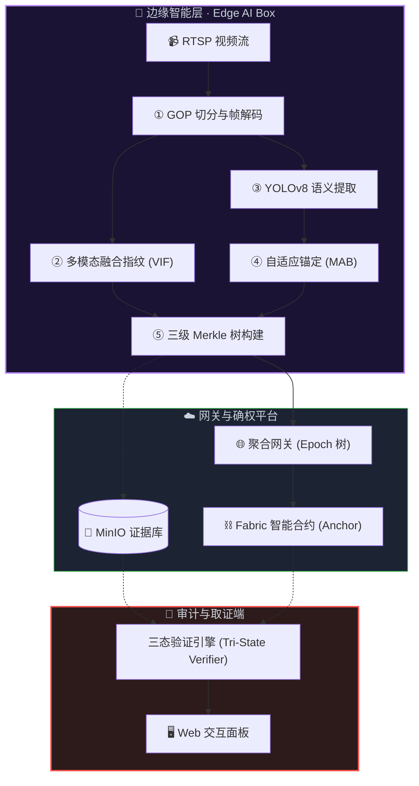

# 基于边缘AI与联盟链的监控视频防篡改解决方案
(SecureLens: Video Integrity Verification System)

> 一个结合边缘 AI 智能分析与区块链不可篡改特性的监控视频取证系统

[项目简介](#-项目简介) • [功能特性](#-功能特性) • [安装使用](docs/GETTING_STARTED.md) • [文档库](docs/GETTING_STARTED.md) • [📝 版本更新](CHANGELOG.md)

SecureLens 利用边缘设备上的 AI 模型对监控视频进行实时语义与特征提取，并结合 Hyperledger Fabric 联盟链技术实现防篡改和快速审计。在保证司法级证据效力的同时，通过多模态融合视频指纹（VIF）和基于强化学系（MAB）的自适应上链策略，降低了 95% 的链上存储成本。

---

## 📚 快速导航

- **[安装与快速开始指南](docs/GETTING_STARTED.md)**：环境配置、启动网络、API 文档、故障排查
- **[📝 版本更新](CHANGELOG.md)**：了解最近架构演进与修复历史

---

## 📖 项目简介

本项目实现了一套完整的监控视频防篡改解决方案，通过在边缘设备上部署AI模型进行实时视频分析，结合Hyperledger Fabric联盟链技术确保视频数据的完整性和可追溯性。系统采用三级Merkle树结构、多模态融合视频指纹（VIF）和基于Multi-Armed Bandit的自适应锚定策略，在保证安全性的同时大幅降低链上存储成本。

### 核心价值

- **防篡改保障**：视频哈希上链后不可篡改，提供法律级别的证据效力
- **智能分析**：边缘AI实时检测目标，自动提取语义指纹
- **成本优化**：自适应锚定策略根据场景重要性动态调整上链频率，降低95%链上交易
- **三态验证**：支持完整（INTACT）、转码（RE-ENCODED）、篡改（TAMPERED）三种验证结果
- **精确定位**：利用Merkle路径二分查找，可精确定位篡改时间点（精度1-2秒）

---

## ✨ 功能特性

### 🎥 边缘智能层

- **GOP级视频切分**：使用 pyav 库按 GOP（Group of Pictures）切分视频流
- **多模态哈希计算**：
  - 密码学哈希（SHA-256）：对 GOP 原始编码字节计算
  - 深度感知哈希（Deep pHash）：MobileNetV3-Small + LSH 压缩为 64-bit 指纹
  - 语义哈希（Semantic Hash）：YOLOv8-nano 提取目标类别计数
- **多模态融合指纹（VIF v2.1）**：
  - 融合感知特征（576d）+ 语义特征（576d）+ 时序光流（96d）+ 压缩域运动矢量（MV Tag）
  - LSH 投影到 256 位固定长度和防伪标记
- **三级 Merkle 树**：GOP → Chunk(30s) → Segment(5min) 层级结构
- **自适应锚定 (MAB)**：
  - UCB1 / Thompson Sampling 策略，动态学习最优锚定间隔（每 1/2/5/10 个 GOP）

### 🌐 聚合网关层

- **多设备聚合**：支持多路视频流同时接入
- **Epoch Merkle 树**：每 30 秒聚合所有设备的 SegmentRoot
- **设备签名验证**：ECDSA 数字签名确保数据来源可信
- **历史数据管理**：SQLite 存储 Merkle 树结构和历史记录

### ⛓️ 联盟链层

- **Hyperledger Fabric**：单机 Docker 模拟多节点部署
- **智能合约**：存储 EpochRoot，验证 Merkle 路径和哈希一致性
- **三态判定**：链下计算三态结果，链上只做 Merkle 验证

### 💾 分布式存储层

- **MinIO 对象存储**：存储视频分片、语义 JSON、Merkle 树结构
- **内容寻址**：自行计算 SHA-256 作为 CID 实现内容寻址

---

## 🏗️ 核心系统架构

系统分为四个核心层：**边缘智能层**（视频分析与指纹提取）、**聚合网关层**（多节点协调与批处理）、**分布式存储层**（MinIO 保存原始证据）、以及**联盟链层**（Hyperledger Fabric 哈希上链存证）。

---

## 🔬 核心技术一：多模态融合视频指纹 (VIF v2.1) 

传统的视频哈希（如 SHA-256）对像素变化极其敏感，合法的视频转码或压缩会导致哈希彻底改变，从而产生极高的误报率（False Positive）。

为了解决"重压缩"与"恶意篡改"之间的区分问题，本项目引入了**多模态融合视频指纹（Video Integrity Fingerprint, VIF）**。VIF 同时提取空间的感知特征、语义特征和时序的运动特征，通过局部敏感哈希（LSH）将高维特征压缩为一段定长（256-bit）的抗鲁棒哈希。

### VIF 算法原理解析

VIF 结合三种互相正交的模态，并附带编码器时序来源标记：

#### 1. 👁️ 感知模态 (Vis) —— 像素级鲁棒特征
- **算法**：基于 `MobileNetV3-Small`（预训练权重的深层卷积特征）。提取池化后的 576d 特征向量。
- **作用**：捕捉整图色调、纹理与全局布局。
- **敏感性**：对合法的 CRF 重压缩、细微光照变化具有抗性；对明显的大面积像素篡改（如：帧替换、高强度噪声、目标遮挡）高度敏感。

#### 2. 🏷️ 语义模态 (Sem) —— 目标级特征
- **算法**：结合 YOLOv8 的目标检测计数，并将 `MobileNetV3` 的底层网格特征（池化前的空间特征图）进行特征融合（Global Average Pooling）。
- **作用**：捕捉画面中的特定目标群和语义结构。
- **敏感性**：具有一票否决权（Semantic Veto）—— 如果画面中突然凭空消失或凭空捏造出一辆车、一个人，哪怕在像素占比上极小，也会触发语义突变告警，直接判定为篡改（TAMPERED）。

#### 3. 🎬 时序模态 (Tem) —— 帧间动态特征
- **算法**：对 GOP 内均匀采样的帧计算 **Farneback 稠密光流**（或可选压缩域 MV），提取运动边界与分布特征。
- **作用**：验证视频的时间连贯性与运动模式。
- **敏感性**：对丢帧、抽帧、插帧、以及 Deepfake 面部局部重动画（导致的背景/前景相对运动异常）高度敏感。

#### 4. 🧷 时序来源标记与 MV 惩罚 (Temporal Source Tag)
在处理高级定向篡改（如 P/B 帧字节级篡改）时，由于攻击破坏了原编码视频的运动矢量结构，而合法的转码/重压缩则会保留有效的运动矢量（MV）。
- **Tag = 'm'**：能提取到合法的 `motion_vectors`
- **Tag = 'f'**：提取失败，回退到基于像素的光流估计（Farneback）
- **MV Loss Penalty**：如果原始指纹的 Tag 是 `'m'`，但验证时重建的指纹变成 `'f'`，说明遭受了破坏编码结构的字节级攻击，验证器将触发 $+0.10$ 的刚性风险惩罚。

### 指纹融合与加权风险判定

三个模态分别通过不同种子的 **LSH 投影矩阵** 降维，拼接成最终 256 位指纹：
`VIF = hash_vis (64bit) || hash_sem (64bit) || hash_tem (128bit) || tag (8bit)`

在最终的防篡改**三态判定 (Tri-State Verification)** 中，系统对旧指纹与新指纹逐位计算 Hamming 距离（$D_{vis}, D_{sem}, D_{tem}$），并套用公式：

$$ Risk = 0.35 \times D_{vis} + 0.40 \times D_{sem} + 0.25 \times D_{tem} + MV\_Penalty $$

- **INTACT (完整) ✅**：原始 SHA-256 完美匹配。
- **RE-ENCODED (重压缩/合法转码) ⚠️**：SHA 不匹配，但 $Risk$ 小于阈值 $<0.15$。判定为由于磁盘优化导致的合法画质降低，内容逻辑未变。
- **TAMPERED (恶意篡改) ❌**：$Risk \ge 0.15$ 或触发语义预警。检测到帧替换、换脸、目标擦除、字节注入等攻击。

---

## 🤖 核心技术二：MAB 强化学习自适应上链

如果将监控摄像头产生的所有视频哈希都无差别存入 Hyperledger Fabric 联盟链，将产生不可接受的 TPS 压力与存储成本。但在夜间或死角等长时间无事件发生的场景中，高频上链毫无意义。

本项目在边缘端引入了**多臂老虎机 (Multi-Armed Bandit, MAB)** 辅助决策系统。

### 动态锚定引擎 (Adaptive Anchor)

边缘 AI (YOLO) 解析当前监控画面的目标活跃度（EIS: Event Importance Score）。基于 EIS，系统动态调整将 Merkle 树 SegmentRoot 推送上链的频率（称之为：挂锚点 Anchor）。

- **可选策略臂 (Arms)**：包含 `[每 1 GOP, 每 2 GOP, 每 5 GOP, 每 10 GOP]` 锚定一次四种频率。
- **UCB1 / Thompson Sampling**：系统通过实时探索与利用（Explore & Exploit）。当场景中发生高价值事件（如大量人群聚集），模型算法不仅调高锚定频率（每 1 GOP上链一次，约延迟1秒），并惩罚低频臂；反之在空闲时，选择最低频臂（每 10 GOP 上链一次）降低成本。
- **成果**：在保证安全审计实时性的同时，可节约 **90% - 95%** 的区块链读写与存储开销。

---

## 📝 版本更新

### v1.4.0 (2026-03-24 ~ 2026-03-25)
✅ 压缩域运动矢量 (MV)：提取 192d 运动特征与时序来源标记 (Temporal Source Tag)
✅ P/B 帧高级篡改检测：引入 MV Loss 刚性惩罚机制
✅ 交互式可视化：前端 Merkle 树动态交互与哈希完整下钻显示
✅ 架构重构：Demo 重签发管线与 VIF 算法三模态解耦

### v1.3.0 (2026-03-23)
✅ 多模态融合指纹 VIF：感知哈希 + 语义特征 + 时序光流 → 256 位融合指纹
✅ MAB 自适应锚定：UCB1 / Thompson Sampling 动态学习最优锚定间隔

### v1.2.0 (2026-03-23)
✅ 完整版 EIS：光流运动分析 + 统计异常检测 + 规则引擎加权融合
✅ 深度感知哈希升级：MobileNetV3-Small + LSH 压缩

### v1.1.0 (2026-03-16 ~ 2026-03-17)
✅ 语义指纹与组合验证
✅ 网关聚合服务（EpochMerkleTree）
✅ 自适应锚定模块（EIS 评分）
✅ GOP 验证与三态验证器
✅ 篡改检测演示脚本

### v1.0.0 (2026-03-13 ~ 2026-03-15)
✅ GOP 级视频切分 + 三重哈希计算
✅ Merkle 树类封装（序列化 + 证明）
✅ MinIO 分布式存储集成
✅ Fabric 智能合约（Anchor / VerifyAnchor）
✅ 端到端测试

> 完整更新日志见 [CHANGELOG.md](CHANGELOG.md)

---

## ⚖️ License

MIT License. See `LICENSE` for more information.
