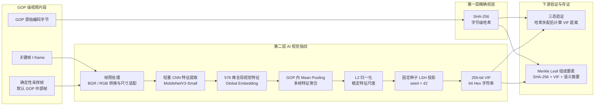

# 第1章 作品概述

## 1.1 作品主题与背景

本作品名为 **SecureLens：基于哈希校验与 AI 视觉指纹的监控视频篡改检测及可信取证系统**，面向智能城市、园区安防、校园管理和公共区域监控等场景，解决监控视频在传输、存储、导出和审计过程中“是否被修改、修改发生在哪里、哈希不一致是否一定代表恶意篡改”等关键问题。监控视频在交通事故追责、公共安全巡查、异常事件复核和证据留存中具有重要价值，但视频文件本身并不天然具备可信性。一段视频从摄像头生成到平台存储，再到导出、转码、共享和审计，可能经历压缩、格式转换、重新封装、剪辑或恶意替换等过程；如果缺少可靠的完整性验证机制，视频即使能够播放，也难以证明其内容未被破坏。

传统的密码学哈希方法可以精确判断文件字节是否完全一致，但它对视频转码和压缩极其敏感。只要视频经过合法的 H.264/H.265 转码、码率调整或分辨率变化，SHA-256 等文件哈希就会完全改变，容易把正常处理误判为篡改。针对这一问题，本作品没有抛弃哈希校验，而是设计了“**哈希优先、AI 视觉指纹补充判定**”的分层验证机制：系统首先使用 SHA-256 对视频 GOP 片段进行字节级精确校验；当哈希一致时，直接判定为完整无修改；只有当哈希不一致时，才进一步调用基于深度视觉特征的 VIF 视频完整性指纹，对视频内容进行宽容匹配，从而区分合法转码与高危疑似篡改。

## 1.2 用户群体与应用场景

本作品主要面向需要保存、验证和审计视频证据的用户群体，包括城市交通与安防监管人员、园区或校园监控管理人员、企业安全生产管理人员、第三方审计人员以及视频证据验证人员。在实际应用中，系统可用于交通事故视频取证、公共区域监控审计、园区异常事件留痕、校园安全事件复核、跨部门视频证据共享和企业安全生产视频归档等场景。对于管理方，系统可以自动生成视频证据指纹、存证证书和链上锚定记录；对于验证方，系统可以上传待验视频并获得 GOP 级三态验证报告，降低人工逐帧核查的成本。

## 1.3 主要功能

SecureLens 围绕“视频证据生成、AI 完整性验证、可信存储、链上审计和前端展示”构建主要功能链路。系统支持接入可配置视频流，并将视频切分为 GOP 级证据单元；对每个 GOP 计算 SHA-256 哈希、VIF v4 视觉完整性指纹和语义信息；在验证阶段输出 `INTACT`、`RE_ENCODED` 和 `TAMPERED_SUSPECT` 三类状态，其中 `INTACT` 表示字节级完全一致，`RE_ENCODED` 表示哈希不同但视觉内容仍处于合法转码容忍范围，`TAMPERED_SUSPECT` 表示视觉风险超过阈值，需要进入后续审计或人工复核。

在可信证据链方面，系统使用 Merkle 树对多个 GOP 的证据摘要进行批量组织，支持通过 Merkle Proof 验证某个 GOP 是否属于原始证据批次，并为后续篡改定位提供依据。原始 GOP 分片、语义 JSON 和 Merkle 结构通过 IPFS 内容寻址存储保存，链上则只写入 Merkle Root、Epoch Root 和必要元数据，以降低存储成本。系统还集成 Hyperledger Fabric 联盟链，实现锚定记录查询、证据验证、审计导出和工单流转。前端提供系统总览、视频证据、三态验证、IPFS 回放、账本查询、自适应锚定和整改工单等页面，用于参赛演示和实际操作。

## 1.4 作品特色与应用价值

本作品的特色在于将 AI 视频理解、密码学哈希、视觉完整性指纹、Merkle 树、IPFS 和联盟链存证整合为面向视频取证的完整软件系统。首先，系统保留 SHA-256 的严格性，将其作为第一层精确校验；其次，系统在哈希失配时引入 VIF v4 视觉指纹，利用 CNN 特征、Mean Pooling 和 LSH 投影生成 256-bit 内容级指纹，缓解合法转码导致的误判问题；再次，系统通过 GOP 级验证把整段视频的完整性问题细化到片段级，便于定位风险发生的时间范围；最后，系统通过 Merkle 批量锚定和 MAB 自适应锚定策略，在可信审计和链上成本之间取得平衡。

从应用价值看，SecureLens 适合部署在已有视频监控平台旁路，不强依赖专用硬件，可以作为视频证据可信验证和审计留痕的辅助系统。它既能服务智能城市视频监管，也能扩展到校园、园区、物业、工厂和企业安全管理等场景。随着视频证据在公共治理和组织管理中的使用频率不断提高，系统所提供的“可验证、可追溯、可解释”的视频完整性验证能力具有较好的推广前景。

# 第2章 问题分析

## 2.1 问题来源

监控视频已经成为城市治理和公共安全管理中的重要数据来源，但视频证据的可信性并不随视频文件本身自动成立。在真实业务流程中，监控视频可能从摄像头或网络视频流进入平台，经过缓存、压缩、切片、导出、转码、跨系统传输和人工拷贝等环节，任何一个环节都可能引入内容变化。部分变化属于正常业务处理，例如降低码率、调整分辨率或从一种编码格式转换为另一种编码格式；部分变化则可能属于恶意篡改，例如替换关键片段、遮挡画面目标、删除异常事件帧或用其他视频片段伪造现场。

这一问题的难点在于，传统文件完整性校验和视频内容理解分别只能解决问题的一部分。密码学哈希能够证明文件字节是否完全一致，但无法解释哈希不一致的原因；AI 视频分析能够识别人、车、异常目标和场景内容，但模型输出本身又缺少可信存证和审计追溯机制。对于需要作为证据使用的视频而言，仅仅判断“能否播放”或“画面看起来相似”是不够的，系统还需要回答三个更具体的问题：第一，视频是否保持了字节级完整；第二，如果字节级不一致，是否可能只是合法转码；第三，如果存在高危篡改，能否定位到具体片段并提供可审计的证据链。

因此，本作品将问题定义为面向监控视频的 AI 辅助完整性验证与可信取证问题。系统输入为原始视频证据及待验证视频，输出为 GOP 级三态验证结果、风险评分、证据存储记录、链上锚定记录和审计报告。该问题既包含图像处理与模式识别中的视觉内容鲁棒匹配，也包含软件系统中的可信存储、证据索引和审计验证，是一个具有明确应用场景的人工智能实践问题。

// todo配图：图 1 视频证据生命周期风险点，展示“视频生成 → 传输 → 存储 → 导出 → 验证 → 审计”，并标注转码、压缩、替换、删除、伪造和存储篡改等风险。

围绕“视频生成、传输、存储、导出、验证和审计”的生命周期，系统将转码、压缩、替换、删除、伪造和存储篡改等风险点纳入统一分析，为后续方案设计提供问题边界。

## 2.2 现有解决方案

围绕监控视频完整性验证，现有方案大致可以分为人工审查、密码学哈希、AI 视频分析和区块链存证四类。它们各自能够解决部分问题，但单独使用时都难以覆盖“合法转码可解释、恶意篡改可发现、证据过程可追溯”的完整需求。

表 1 现有解决方案对比

| 方案类型 | 代表方法 | 主要优点 | 主要局限 |
| --- | --- | --- | --- |
| 人工审查 | 人工播放监控视频、逐帧查看关键片段 | 实施门槛低，适合复杂语义判断 | 成本高、效率低、主观性强，难以处理大规模视频 |
| 密码学哈希 | SHA-256、文件摘要、数字签名 | 字节级精确，适合证明文件完全一致 | 对合法转码和压缩过于敏感，哈希不同无法解释变化原因 |
| AI 视频分析 | 目标检测、异常检测、图像识别、视频指纹 | 能识别画面内容和异常事件，适合自动筛查 | 模型输出需要可信留痕，单独使用时难以形成证据链 |
| 区块链存证 | 哈希上链、时间戳、联盟链审计 | 记录不可篡改，适合跨组织追溯 | 不适合直接存储大视频，全量高频上链成本较高，不能独立判断视频内容变化 |
| 中心化对象存储 | 本地文件系统、对象存储、数据库索引 | 部署简单，读写性能较好 | 存储方需要被信任，文件被覆盖或替换后较难自证 |

人工审查是最直观的方式，但它依赖人员经验和时间投入，难以适应多路摄像头长期运行产生的大规模视频数据。对于细粒度的帧替换、短时遮挡或导出后的多版本视频，人工审查既容易遗漏，也难以给出统一的量化标准。

密码学哈希与数字签名能够提供强一致性证明，是视频证据可信验证中不可替代的基础能力。其局限在于哈希面向字节级内容，只要视频经过合法重编码、压缩或封装变化，哈希值就会发生雪崩式改变。因此，哈希不同只能说明“字节不一致”，不能直接说明“内容被恶意篡改”。如果将所有哈希失配都判定为篡改，会导致合法业务处理下的大量误报。

AI 视频分析方法能够识别画面中的目标、动作、场景变化和异常事件，为自动化审查提供了可能。例如目标检测模型可以统计人、车等对象数量，感知哈希或深度特征可以描述画面内容相似性。但 AI 输出通常是概率性或相似性结果，如果缺少哈希、时间戳、存储证明和审计日志支撑，单独的模型判断难以满足证据管理场景对可追溯性的要求。

区块链存证通过不可篡改账本保存哈希摘要、时间戳和操作记录，能够增强证据链可信度。但视频文件体积大、生成频率高，直接把视频内容或每个片段全量上链并不现实。同时，链上记录本身只能证明某个摘要在某个时间被写入，无法独立解释视频哈希失配究竟来自合法转码还是恶意篡改。

综上，现有方案的共同不足在于缺少面向视频取证流程的协同机制：哈希需要内容级解释，AI 判断需要可信留痕，链上存证需要成本控制，审计人员需要片段级定位和可读报告。SecureLens 正是在这一需求交叉点上进行设计。

## 2.3 本作品要解决的痛点问题

本作品重点解决五类痛点。

第一，解决“哈希失配等同篡改”的误判问题。传统文件哈希只能判断字节是否完全一致，无法区分合法转码和恶意修改。本作品将 SHA-256 作为第一层精确校验，在哈希一致时直接判定完整；在哈希不一致时，再使用 VIF 视觉完整性指纹进行内容级宽容判断，从而把“字节变化”进一步解释为“合法转码”或“高危疑似篡改”。

第二，解决整文件验证难以定位问题片段的问题。如果只对整段视频计算摘要，系统只能知道文件整体发生变化，却难以说明变化发生在哪个时间范围。本作品将视频切分为 GOP 级证据单元，并在 GOP、Chunk、Segment 等层级构建 Merkle 结构，使验证结果能够细化到视频片段，为后续审计复核提供定位依据。

第三，解决视频证据存储过程缺少可信背书的问题。仅依赖本地文件系统或普通数据库时，证据文件、索引记录和审计记录都可能被覆盖或修改。本作品将原始 GOP 分片和证据结构存入 IPFS，通过内容寻址机制保证 CID 与内容绑定，同时将 Merkle Root 和关键元数据锚定到 Fabric 联盟链，使证据生成时间、批次摘要和验证过程具备可追溯性。

第四，解决全量高频上链成本过高的问题。监控视频持续产生数据，如果每个片段都以固定高频率写入区块链，会带来较高的交易压力和存储负担。本作品使用 Merkle 批量锚定降低链上记录数量，并引入基于 EIS 和 MAB 的自适应锚定策略，根据场景活跃度、锚定成功率、成本和延迟动态选择上链间隔。

第五，解决人工审查效率不足的问题。大规模视频审计不适合完全依赖人工逐帧观看。本作品通过 YOLO 语义检测、VIF 风险评分、GOP 级结果表和可视化审计报告，为审计人员提供自动化初筛结果。系统并不把高危结果直接等同为最终司法结论，而是将其定位为可复核、可追溯的风险提示。

## 2.4 解决问题的思路

针对上述问题，本作品采用“AI 识别与验证 + 哈希精确校验 + 内容寻址存储 + 联盟链审计”的总体思路。系统首先将输入视频切分为 GOP 级片段，对每个片段保存原始编码字节、时间范围、关键帧和采样帧；随后计算 SHA-256 哈希作为字节级完整性依据，并提取 VIF v4 视觉完整性指纹作为哈希失配后的内容级判断依据。在验证阶段，系统优先比较 SHA-256：若哈希一致，输出 `INTACT`；若哈希不一致，则计算原始 VIF 与当前 VIF 的归一化汉明距离，根据阈值输出 `RE_ENCODED` 或 `TAMPERED_SUSPECT`。这一流程既保留了密码学哈希的严格性，也避免把合法视频处理简单归为恶意篡改。

在可信证据管理方面，系统将 GOP 级证据摘要组织为 Merkle 树，并将 Root 写入 Fabric 联盟链。原始 GOP 分片、语义 JSON、Merkle 结构和回放所需元数据存入 IPFS 与 SQLite 索引中，形成“链下保存内容、链上保存摘要”的结构。这样既避免大文件直接上链造成的成本问题，又能通过 Merkle Proof 和链上 Root 验证某个视频片段是否属于原始证据集合。

在 AI 应用方面，系统使用 YOLO 模型提取监控画面中的人、车等目标信息，并生成语义指纹和事件重要性评分。对于视频完整性验证，VIF v4 使用深度视觉特征、Mean Pooling 和 LSH 投影生成 256-bit 定长视觉指纹；对于锚定策略，系统引入 MAB 多臂老虎机方法，在不同上链间隔之间进行动态选择，使系统在低活跃场景下减少链上写入，在高风险或高活跃场景下提高证据锚定频率。

系统的功能需求主要包括：支持可配置视频流接入；支持 GOP 级证据生成；支持 SHA-256 与 VIF 分层三态验证；支持 Merkle Proof 验证和篡改片段定位；支持 IPFS 内容寻址存储、Fabric 链上锚定、账本查询和审计导出；支持 Web 前端展示验证结果、风险评分、GOP 表格、存证证书和工单流程。系统的性能与可靠性需求包括：VIF 输出长度固定且相同输入结果稳定；Merkle Proof 能够正确验证证据归属；MAB 策略能够根据奖励反馈更新状态；前端验证报告能够清晰展示视频级和 GOP 级结果。

本作品使用的数据主要包括三类。第一类是系统接入的可配置视频流，数据格式包括 HLS、RTSP/HTTP 等网络视频流；第二类是系统测试中生成的合成 GOP 和合成帧数据，用于验证 VIF、Merkle、三态验证和 MAB 等核心模块的确定性与正确性；第三类是用于扩展评估的转码与篡改样本数据，包括原始视频、不同编码格式和压缩参数下的合法重编码视频，以及通过帧替换、内容遮挡或片段替换生成的篡改样本。

表 2 数据来源与用途

| 数据类型 | 来源与获取方式 | 数据格式 | 主要用途 |
| --- | --- | --- | --- |
| 原始监控视频 | 可配置视频流 | HLS、RTSP/HTTP 流 | 生成 GOP 证据、计算哈希和 VIF |
| 合法转码样本 | 对原始视频进行编码格式、码率、分辨率调整 | MP4 等视频文件 | 验证哈希失配后 VIF 对合法转码的宽容能力 |
| 篡改样本 | 帧替换、内容遮挡、片段替换、噪声注入等方式生成 | MP4 等视频文件 | 验证高危疑似篡改识别和 GOP 级定位能力 |
| 合成测试数据 | 单元测试程序生成 | NumPy 帧、GOP 对象、JSON | 验证算法模块确定性、稳定性和边界情况 |
| 链上与存储记录 | 系统运行生成 | CID、Merkle Root、交易 ID、SQLite 记录 | 验证证据链追溯、账本查询和审计导出 |

通过上述设计，本作品将“视频内容是否可信”的问题拆解为可计算、可存证、可验证和可展示的多个环节：哈希负责精确一致性，VIF 负责哈希失配后的内容级解释，Merkle 树负责片段级组织与证明，IPFS 负责证据内容寻址保存，Fabric 负责关键摘要和审计记录的可信留痕，Web 平台负责面向用户的操作和报告展示。

# 第3章 技术方案

## 3.1 总体技术路线

SecureLens 的技术路线围绕“AI 视频完整性验证”和“可信证据链管理”两条主线展开。系统首先从可配置视频流中获取监控视频数据，将连续视频按照 GOP 切分为可验证的片段级证据单元；随后对每个 GOP 计算 SHA-256 哈希，并提取 VIF v4 AI 视觉完整性指纹。在验证阶段，系统采用哈希优先的分层判定流程：当 SHA-256 完全一致时，直接确认该 GOP 保持字节级完整；当 SHA-256 不一致时，再使用 VIF 视觉指纹计算内容级差异，从而区分合法转码与高危疑似篡改。

在证据组织层面，系统将 GOP 级证据摘要组织为 Merkle 树，使用 Merkle Root 表示一组视频片段的整体证据摘要，并通过 Merkle Proof 验证单个 GOP 是否属于原始证据集合。在此基础上，系统将 GOP 分片、语义 JSON 和 Merkle 结构保存到 IPFS 内容寻址存储中，并将 Merkle Root、Epoch Root 和关键元数据锚定到 Hyperledger Fabric 联盟链。这样既避免将大体积视频直接写入链上，又能保留证据生成、存储和验证过程的可追溯性。

在 AI 决策层面，系统通过 YOLO 模型感知监控画面中的人、车等目标，形成语义统计和画面活跃度输入；再通过 EIS 事件重要性评分与 MAB 自适应锚定策略，动态选择 GOP 锚定间隔。该部分在前端呈现为“智能锚定决策引擎”演示模块，展示“EIS 输入 → 当前上链策略 → GOP 锚定间隔 → 上链输出”的完整决策链路。

// todo配图：图 2 SecureLens 总体技术路线图，突出“视频流输入、GOP 切分、SHA-256 + VIF 三态验证、Merkle 证据组织、AI 自适应锚定、IPFS/Fabric 可信支撑”的数据流。

## 3.2 GOP 级证据单元构建

GOP（Group of Pictures）是本作品进行视频完整性验证的基本粒度。相比直接对整段视频进行一次性校验，GOP 级处理能够把视频证据拆分为具有明确时间范围的小片段，使系统不仅能判断视频是否发生变化，还能进一步定位变化发生的大致位置。系统在读取视频流后，通过 PyAV 等视频处理工具解析编码包与关键帧信息，为每个 GOP 保存起止时间、原始编码字节、字节大小、帧数量、关键帧和少量确定性采样帧。

每个 GOP 会生成多个证据要素。首先，系统对 GOP 原始编码字节计算 SHA-256 哈希，用于字节级完整性校验。该哈希具备强一致性，只要 GOP 原始字节发生任意变化，哈希值就会改变。其次，系统从 GOP 的关键帧和采样帧中提取视觉特征，生成 VIF v4 视觉完整性指纹，用于在哈希失配后判断画面内容是否仍处于合法转码的容忍范围。最后，系统可结合 YOLO 语义检测结果生成语义 JSON 和语义哈希，为后续事件理解、活跃度评分和审计展示提供补充信息。

GOP 级证据单元的设计使系统具备片段化验证能力。对于完整视频，系统可以将多个 GOP 的证据摘要组合为 Merkle 树；对于待验证视频，系统可以逐 GOP 重新计算哈希和 VIF，并与原始记录进行对比。这样既避免整文件验证粒度过粗的问题，也为后续的 Merkle Proof、IPFS 存储和链上锚定提供统一的数据基础。

## 3.3 哈希优先的分层三态验证机制

本作品的核心验证机制是“SHA-256 哈希优先，VIF 视觉指纹补充判定”。该设计不是用 AI 指纹替代密码学哈希，而是将两者放在不同职责层级中：SHA-256 负责判断视频片段是否保持字节级完全一致，VIF 负责在哈希不一致时解释内容层面的相似性。这样既保留了密码学哈希的严格性，又能缓解合法转码、压缩和格式转换导致的误判。

具体判定流程如下。第一步，系统比较原始 GOP 的 SHA-256 与待验证 GOP 的 SHA-256。如果两者完全一致，说明 GOP 原始字节没有发生变化，系统直接输出 `INTACT`，风险值为 0。第二步，如果 SHA-256 不一致，系统不会立即判定为恶意篡改，而是检查原始 GOP 与当前 GOP 是否都具有 VIF 指纹。如果 VIF 缺失或格式不合法，系统将其视为高危异常，输出兼容状态 `TAMPERED`，并在详情中标记 `TAMPERED_SUSPECT`。第三步，如果两侧 VIF 均存在，系统计算二者的归一化汉明距离作为风险值：

```text
Risk = HammingDistance(VIF_orig, VIF_curr) / 256
```

当 `Risk < 0.35` 时，系统认为两段视频虽然字节不同，但视觉内容仍处于合法转码或压缩的容忍范围内，输出 `RE_ENCODED`。当 `Risk >= 0.35` 时，系统认为视觉内容差异已经突破容忍阈值，输出兼容状态 `TAMPERED`，并在状态描述中标记为 `TAMPERED_SUSPECT`。这里的高危疑似篡改并不等同于最终司法结论，而是作为系统自动化初筛结果，提示审计人员进入后续复核流程。

该三态机制解决了传统哈希校验的关键局限。单纯 SHA-256 只能回答“字节是否一致”，无法回答“不一致是否合理”；而分层三态验证进一步给出“完整无修改、合法转码、高危疑似篡改”三类解释，使系统更适合真实视频证据流转场景。

// todo配图：图 3 SHA-256 与 VIF 分层三态验证流程图，突出“哈希一致直接完整，哈希不一致再进入 VIF 判断”的逻辑。

## 3.4 VIF v4 AI 视觉完整性指纹

VIF（Video Integrity Fingerprint）是本作品用于视频内容级宽容判断的 AI 视觉完整性指纹。它的设计目标不是像 SHA-256 一样捕捉任意字节级变化，而是在视频经历合法转码、压缩或分辨率调整后，仍能保留对核心视觉内容的相似性描述。因此，VIF 被放置在哈希失配后的第二层验证中，用于帮助系统判断视频内容变化是否超出可接受范围。

VIF v4 的生成流程包括视觉特征提取、GOP 内特征聚合和 LSH 投影三个阶段。首先，系统从 GOP 中选取关键帧和确定性采样帧，将帧输入深度视觉特征提取模块，获得 576 维全局视觉特征。该特征来自轻量化 CNN 表征，能够描述画面的整体颜色、纹理、布局和主体结构。其次，系统对 GOP 内多个采样帧的视觉特征进行 Mean Pooling，并进行归一化处理，使单个 VIF 能代表整个 GOP 的视觉内容，而不是仅代表某一帧的封面信息。最后，系统使用固定随机种子的 LSH 投影，将聚合后的特征映射为 256-bit 定长指纹，并以 64 字符十六进制字符串保存。

VIF v4 采用固定输出位宽和确定性投影方式，便于与数据库、Merkle 叶子哈希和前端验证报告对接。相同输入在相同配置下应得到稳定输出，不同视觉内容应产生不同指纹；当视频发生合法转码时，VIF 允许在阈值范围内产生有限差异；当画面内容发生明显替换、遮挡或破坏时，VIF 汉明距离会升高，从而触发高危疑似篡改提示。

// todo配图：图 4 VIF v4 指纹生成流程，包括“GOP 采样帧 → CNN 视觉特征 → Mean Pooling → LSH → 256-bit VIF”。


图 4  VIF v4 视觉完整性指纹生成架构




## 3.5 Merkle 树与篡改定位

在完成 GOP 级哈希、VIF 和语义摘要生成后，系统需要将大量片段级证据组织为可验证的数据结构。SecureLens 使用 Merkle 树对 GOP 摘要进行批量组织：每个 GOP 对应一个叶子节点，叶子可以由 SHA-256、VIF、语义哈希等证据要素组合计算得到；多个叶子逐层哈希合并，最终得到一个 Merkle Root。该 Root 可以代表一组 GOP 的整体证据状态，并作为后续 IPFS 保存和 Fabric 链上锚定的核心摘要。

Merkle 树的优势在于能够用较小的证明数据验证单个 GOP 是否属于原始证据集合。验证某个 GOP 时，系统不需要重新传输整棵树或整段视频，只需要提供该 GOP 的叶子哈希和从叶子到 Root 的 Merkle Proof。验证端根据 Proof 逐层计算得到候选 Root，并与链上或存储中的原始 Root 比较。如果二者一致，说明该 GOP 摘要属于原始证据批次；如果不一致，则说明该片段或其证明路径存在异常。

为了适应长时间监控视频，系统进一步支持层级化证据组织。GOP 先聚合为 Chunk，多个 Chunk 再聚合为 Segment，SegmentRoot 或 EpochRoot 作为更高层级的证据摘要进入锚定流程。通过这种结构，系统既可以在宏观上验证某段时间内的视频证据是否可信，也可以在发现异常后下钻到具体 GOP 范围，辅助审计人员定位高风险片段。

// todo配图：图 5 GOP → Chunk → Segment 三级 Merkle 结构，标注 Leaf、Root 和 Proof 的关系。

## 3.6 AI 事件理解与自适应锚定决策引擎

在 Merkle 树生成 SegmentRoot 之后，系统还需要决定何时将证据摘要锚定到联盟链。如果对所有 GOP 都采用固定高频上链，系统会产生较高的链上交易成本；如果锚定频率过低，又可能影响关键事件的审计及时性。因此，SecureLens 将视频语义理解与自适应锚定结合，构建“AI 事件理解与自适应锚定决策引擎”，并在前端智能锚定控制台中进行可视化展示。

该决策引擎的第一步是 YOLO 语义感知。系统在视频帧上运行目标检测模型，识别人、车等监控场景中的关键目标，并统计一段时间或一个 GOP 窗口内的目标类别和数量。YOLO 输出不是直接作为篡改检测结论，而是作为场景理解信号，帮助系统判断当前画面是否处于高活跃、高风险或普通运行状态。系统通过桥接模块将 YOLO 每帧检测结果汇聚到 GOP 级语义摘要中，为后续 EIS 计算提供输入。

第二步是 EIS（Event Importance Score）画面活跃度评分。EIS 将目标数量、运动变化和异常信号转化为 0 到 1 之间的活跃度分数，并划分为低活跃、中活跃和高活跃等级。在轻量模式下，系统主要依据 YOLO 目标计数判断画面活跃度；在完整模式下，系统还可以融合光流运动特征、统计异常检测结果和规则引擎输出。前端“画面活跃度”仪表盘展示这一评分结果，使用户能够直观看到系统对当前监控画面变化强度的判断。

第三步是 MAB 自适应上链频率选择。系统将不同 GOP 锚定间隔建模为多臂老虎机中的候选臂，包括“逐段上链”“高频上链”“均衡上链”和“节能上链”等策略，对应 `1 / 2 / 5 / 10 GOP` 的候选锚定间隔。MAB 根据锚定成功率、成本和延迟等反馈计算奖励，并使用 UCB1 或 Thompson Sampling 在不同策略之间动态选择。这样，系统可以在画面变化明显或活动频繁时提高锚定频率，在画面稳定时降低链上写入频率，从而在审计及时性和资源成本之间取得平衡。

在前端智能锚定控制台中，该模块被呈现为“EIS 输入 → 当前上链策略 → GOP 锚定间隔 → 上链输出”的决策链路。页面同时展示当前画面活跃等级、正在生效的上链策略、GOP 锚定间隔、预计节省资源、实际锚定比例、策略决策总数和链上锚定次数。需要强调的是，MAB 不是篡改检测算法，而是根据 AI 感知结果和链上反馈动态控制证据锚定成本的决策模块。它的作用是让可信存证过程从固定规则升级为场景自适应策略。

// todo配图：图 6 智能锚定控制台截图或决策链路图，展示 EIS 输入、当前策略、GOP 锚定间隔和上链输出。

## 3.7 IPFS 内容寻址存储

监控视频文件体积大、片段多，不适合直接写入区块链。SecureLens 采用 IPFS 内容寻址存储保存 GOP 分片、语义 JSON、Merkle 结构和回放所需元数据。IPFS 的核心特点是 CID 与内容绑定：同一份内容会生成确定的内容标识，内容发生变化时 CID 也会随之变化。因此，CID 不只是存储地址，也可以作为内容完整性校验的一部分。

系统在处理 GOP 后，将 GOP 原始字节写入 IPFS，并将返回的 CID 保存到本地索引中。语义 JSON、Merkle Tree JSON 等结构化证据数据也可以同步写入 IPFS。SQLite 索引用于维护设备编号、GOP 时间范围、SHA-256、VIF、CID、播放元数据等关系，使前端能够按设备和时间范围查询 GOP，并生成 HLS 回放或证据导出结果。通过这种方式，系统将大体积证据内容保存在链下，同时保留可验证的内容寻址能力。

IPFS 与 Merkle/Fabric 形成互补关系。IPFS 负责保存可恢复的证据内容，Merkle 树负责组织片段级摘要并生成可验证 Root，Fabric 负责对关键 Root 和审计信息进行可信留痕。验证时，系统可以通过 CID 获取链下内容，重新计算哈希与 VIF，再结合 Merkle Proof 和链上 Anchor 判断证据是否与原始记录一致。

## 3.8 Fabric 联盟链锚定

Hyperledger Fabric 联盟链用于保存视频证据链中的关键摘要和审计记录。考虑到视频内容体积较大，系统不将原始视频直接上链，而是采用“链下存内容、链上存摘要”的方式：GOP 分片和 JSON 结构保存在 IPFS，Merkle Root、Epoch Root、设备信息、时间戳和交易元数据写入 Fabric。这样既能利用联盟链的不可篡改和多方审计能力，又能避免链上存储成本过高。

系统链码提供 Anchor、QueryAnchor、VerifyAnchor 等能力，用于提交锚定记录、查询历史锚定和验证 Merkle 证明。对于单个 GOP 或某个证据批次，验证端可以先从 IPFS 获取内容并计算摘要，再通过 Merkle Proof 计算 Root，最后与 Fabric 链上保存的 Root 进行比对。如果 Root 匹配，说明该证据片段与原始锚定记录一致；如果不匹配，则说明证据内容、索引或证明路径存在异常。

Fabric 层还支持多组织审计和工单流程，为系统从“技术验证”扩展到“管理闭环”提供基础。管理方可以生成证据与整改工单，审计方可以查询链上记录并导出审计报告，验证方可以根据链上 Root 与链下证据进行复核。通过 Fabric，AI 三态验证结果、Merkle 证据组织和 IPFS 内容存储被连接成一条可追溯的可信证据链。

# 第4章 系统实现

## 4.1 软件架构与技术栈

SecureLens 采用前后端分离的软件架构，将视频处理、AI 指纹提取、可信存储和审计展示拆分为相互协作的模块。后端以 FastAPI 为服务入口，负责接收视频上传、调度 GOP 切分、调用 SHA-256 与 VIF 生成逻辑、维护 SQLite 元数据索引，并与 IPFS 和 Hyperledger Fabric 完成证据存储及链上锚定。前端以 React + Vite 构建，面向参赛演示和实际操作提供系统总览、视频证据、三态验证、IPFS 回放、账本查询、智能锚定和整改工单等页面。AI 模块、可信存证模块和 Web 展示模块通过 API 连接在一起，使系统能够完成从视频证据生成到审计验证的闭环。

表 3 系统技术栈

| 层次 | 技术 | 作用 |
| --- | --- | --- |
| 前端 | React + Vite | 系统展示、证据验证、审计操作 |
| 后端 | FastAPI | 视频处理 API、验证 API、状态查询 |
| AI | PyTorch、Ultralytics YOLO、MobileNetV3 | 目标检测、视觉指纹生成 |
| 视频处理 | OpenCV、PyAV、FFmpeg | 视频流读取、GOP 切分、HLS 回放 |
| 存储 | SQLite、IPFS | 元数据索引、内容寻址存储 |
| 区块链 | Hyperledger Fabric、Go Chaincode | Root 锚定、审计验证 |
| 测试 | Pytest、Go test | 算法模块与链码逻辑测试 |

这种分层实现方式使系统既能保持 AI 验证逻辑的独立性，也能将验证结果可靠地纳入证据管理流程。前端不直接处理视频底层数据，而是通过后端 API 获取证据状态和验证结果；后端不把大体积视频写入链上，而是将 GOP 分片和结构化证据保存在 IPFS 与本地索引中，再把 Merkle Root、Epoch Root 和必要元数据提交到 Fabric。通过这种职责划分，系统可以在不依赖专用硬件的情况下，以软件形式部署在已有监控平台旁路。

## 4.2 后端实现

FastAPI 后端是系统各模块的调度中心。系统启动后，后端负责加载配置项、初始化视频存储索引、连接 IPFS 服务、准备 Fabric 客户端，并向前端提供统一的 REST API。配置项集中在 `.env` 与 `config.py` 中，便于切换本地演示、IPFS 节点、Fabric 网络、YOLO 模型路径和视频流地址等运行参数。

视频上传接口负责把用户提供的视频转化为可验证证据。当前后端通过 `POST /api/video/upload` 接收视频文件后，会将视频保存到上传目录，并调用 GOP 处理逻辑生成片段级证据记录。每个 GOP 会绑定视频编号、设备编号、起止时间、SHA-256 哈希、VIF v4 视觉完整性指纹、语义摘要和存储位置等元数据。这些记录写入 SQLite 索引，供后续证书生成、验证查询和前端展示使用。

三态验证接口负责把待验视频与原始证据进行逐 GOP 对比。系统通过 `POST /api/video/verify` 接收待验视频，并对其重新执行 GOP 切分、哈希计算和 VIF 提取；随后后端调用三态验证逻辑，优先比较 SHA-256，在哈希失配时再进入 VIF 补充判定。验证结果以视频级摘要和 GOP 级明细返回前端，其中 `INTACT` 表示字节级一致，`RE_ENCODED` 表示哈希不同但视觉内容仍处于合法转码容忍范围，`TAMPERED_SUSPECT` 表示高危疑似篡改，需要进入后续审计或人工复核。

可信存储接口负责连接链下内容与链上摘要。系统可将 GOP 分片、语义 JSON、Merkle 结构和回放索引写入 IPFS，并通过 CID 在数据库中建立内容寻址关系；同时，后端通过 Fabric 客户端提交 Anchor、查询 Anchor 和验证 Anchor，使前端能够展示区块、交易、Root 和证据批次之间的对应关系。对于回放需求，后端还提供 IPFS 回放相关接口，使用户能够按设备和时间范围查询 GOP 并生成 HLS 播放列表。

审计与智能锚定接口负责支撑系统管理闭环。后端提供锚定统计接口，用于返回当前 MAB 策略、GOP 锚定间隔、锚定次数和策略决策状态；同时提供工单与审计导出接口，用于把高危疑似篡改结果转化为后续处理记录。这样，AI 验证结果不仅停留在算法输出层面，也能进入可查询、可追踪和可导出的业务流程。

## 4.3 前端实现

前端实现的目标是将复杂的证据处理过程转化为审计人员能够直接操作的可视化界面。系统使用 React + Vite 构建单页应用，并通过统一 API 封装访问后端服务。页面设计围绕“看状态、传视频、验结果、查证据、看链上、出工单”的操作路径展开，使用户能够从系统总览进入具体证据，再从验证结果进入存储与账本细节。

系统总览页用于展示运行状态和关键资源概况。页面集中呈现后端健康状态、设备状态、IPFS 存储状态、链上区块信息和近期证据处理情况，帮助用户快速判断演示环境是否可用。对于参赛展示，这一页面承担入口作用，使评审能够先看到系统不是单一算法脚本，而是包含服务、存储、链上和前端的完整软件平台。

视频证据页是系统最核心的交互页面。用户可以在该页面上传原始视频，查看系统生成的视频证据记录和存证证书；也可以上传待验证视频，触发三态验证流程并查看验证历史。页面中的 GOP 级结果表用于展示每个片段的状态、风险值、时间范围和证据要素，使审计人员能够从整段视频摘要下钻到具体风险片段。

// todo配图：视频证据上传与验证界面截图、GOP 级三态验证结果截图。

IPFS 页和账本页分别展示链下内容与链上摘要。IPFS 页用于按设备、时间或 GOP 查询内容寻址记录，展示 CID、片段信息和回放入口；账本页用于查询区块、交易、Anchor 和 Merkle Root，使用户能够理解证据摘要如何被写入联盟链。二者共同体现“链下保存内容、链上保存摘要”的设计，也让验证方可以从前端追踪某个证据片段对应的存储位置和链上记录。

智能锚定页用于展示 EIS/MAB 自适应锚定策略的运行状态。页面将画面活跃度、当前策略、GOP 锚定间隔、锚定比例、策略决策次数和链上锚定次数组织为可视化指标，说明系统如何根据 AI 感知结果和链上反馈动态调整存证频率。工单页则用于承接高危疑似篡改结果，支持整改工单、审计记录和导出流程，使系统从技术检测延伸到管理闭环。

// todo配图：系统总览页、IPFS 回放页、账本查询页、智能锚定控制台和工单页面截图。

## 4.4 数据处理与证据生成流程

系统的数据处理流程围绕 GOP 级证据单元展开。相比只保存整段视频文件，GOP 级流程可以让系统在验证时定位到更具体的时间范围，并将每个片段的哈希、视觉指纹、语义摘要、CID 和 Merkle Proof 关联起来。整体流程如下。

1. 用户上传视频，或系统从配置的视频流中接入监控数据。
2. 后端解析视频编码结构，并将连续视频切分为 GOP 级证据单元。
3. 系统为每个 GOP 计算 SHA-256 哈希、VIF v4 视觉完整性指纹和语义哈希。
4. GOP 原始分片、语义 JSON、Merkle 结构和回放元数据上传到 IPFS。
5. 系统将 GOP 级证据摘要组织为 Merkle Tree，并生成 Merkle Root 或更高层级的 SegmentRoot、EpochRoot。
6. 后端将 Root、设备信息、时间戳和必要元数据提交到 Hyperledger Fabric。
7. 前端基于后端返回的证据索引和链上信息生成存证证书。
8. 验证时，系统对待验视频逐 GOP 重新计算哈希和 VIF，输出视频级摘要、GOP 级三态结果和审计报告。

这一流程将视频证据从原始文件转化为可计算、可存储、可追溯和可展示的结构化记录。SHA-256 保留字节级精确校验能力，VIF 提供哈希失配后的内容级解释，IPFS 保存链下证据内容，Fabric 保存关键摘要和审计留痕，前端则把底层验证过程转化为证据证书、风险提示和操作记录。

// todo配图：数据处理与证据生成流程图，突出“上传/接入、GOP、AI 指纹、IPFS、Merkle、Fabric、前端报告”的顺序关系。

## 4.5 部署与运行方式

系统部署采用本地服务组合方式，便于参赛演示和后续扩展。后端 Python 依赖通过 `requirements.txt` 安装，运行后提供视频上传、证据验证、IPFS 回放、Fabric 查询和智能锚定等 API。前端依赖通过 `demo2/package.json` 管理，开发环境下可启动 Vite 服务访问系统页面。后端和前端通过 HTTP API 通信，前端不直接访问数据库、IPFS 节点或 Fabric 网络。

IPFS 服务通过 `docker-compose.ipfs.yml` 启动 Kubo 节点集群，用于保存 GOP 分片、语义 JSON、Merkle 结构和回放索引。Fabric 运行依赖本地 `fabric-samples/test-network`，链码由 Go 编写，用于提交 Anchor、查询 Anchor 和验证证据摘要。SQLite 作为本地元数据索引，保存视频编号、GOP 记录、CID、验证历史和证书相关信息。

系统配置集中在 `.env` 与 `config.py` 中，主要包括后端服务端口、上传目录、IPFS 网关地址、Fabric 网络路径、YOLO 模型配置、VIF 参数和视频流地址等。运行时可根据演示需求选择完整环境或轻量环境：完整环境同时启动后端、前端、IPFS 和 Fabric 网络，轻量环境则侧重展示核心算法、基础接口和前端操作流程。

## 4.6 开发中的问题与解决

第一个问题是合法转码会导致 SHA-256 哈希失配。视频在实际流转中常常会经历重编码、压缩或封装格式变化，即使画面内容没有恶意修改，文件字节也会发生变化。系统没有把哈希失配直接等同为篡改，而是采用“SHA-256 哈希优先、VIF 补充判定”的分层机制：哈希一致时确认完整，哈希不一致时再使用 VIF 判断视觉内容是否仍处于合法转码容忍范围。

第二个问题是 VIF 阈值需要兼顾宽容性和风险提示能力。如果阈值过低，合法转码容易被误报；如果阈值过高，明显内容变化可能被放过。当前系统将默认阈值设为 `0.35`，并将该阈值作为工程默认配置使用；在面向更大规模样本或不同场景部署时，可结合合法重编码样本和篡改样本的风险分布继续校准。

第三个问题是多路视频持续上链会带来较高成本。监控视频具有持续产生、片段数量大和多设备并发的特点，如果每个 GOP 都固定上链，会增加链上交易压力。系统通过 Merkle 批量锚定减少链上记录数量，并引入 EIS/MAB 自适应锚定策略，根据画面活跃度、锚定成功率、成本和延迟反馈动态选择 GOP 锚定间隔，从而在可信留痕和资源开销之间取得平衡。

第四个问题是视频证据文件体积大，不适合直接写入区块链。系统采用“链下保存内容、链上保存摘要”的结构，将 GOP 分片、语义 JSON 和 Merkle 结构保存到 IPFS，并将 Merkle Root、Epoch Root 和关键元数据写入 Fabric。这样既能利用 IPFS 的内容寻址能力保存证据内容，又能通过 Fabric 对关键摘要进行可信留痕，避免把区块链当作大文件存储系统使用。

# 第5章 测试分析

## 5.1 测试目标

本章主要说明 SecureLens 的系统功能运行情况和核心模块测试结果。系统已经完成视频证据管理、三态完整性验证、IPFS 证据存储、Fabric 锚定、Merkle Proof、智能锚定决策和前端审计页面等主要功能，因此测试重点放在核心逻辑是否稳定、基础接口是否可用、页面功能是否能够支撑完整演示流程。

测试目标分为三类：第一，验证 `INTACT`、`RE_ENCODED` 和 `TAMPERED_SUSPECT` 三态结果能够按照“SHA-256 哈希优先、VIF 补充判定”的规则输出；第二，验证 VIF、Merkle、证据哈希、视频索引和 MAB 锚定策略等基础模块能够稳定运行；第三，确认系统页面能够围绕视频证据、IPFS 存储、链上账本、智能锚定和工单审计形成可展示的软件闭环。

## 5.2 核心模块测试结果

当前测试采用 Pytest 运行，主要覆盖核心算法模块、证据管理模块和基础 API 行为。测试运行命令和结果如下：

```text
python -m pytest tests -m "not integration" -q
32 passed
```

表 4 核心模块测试结果

| 测试内容 | 对应模块 | 验证结果 |
| --- | --- | --- |
| 三态验证 | `test_tri_state_verifier.py` | 通过 |
| VIF 视觉指纹 | `test_vif.py` | 通过 |
| Merkle 证据组织 | `test_merkle_utils.py` | 通过 |
| 证据哈希 | `test_crypto_utils.py` | 通过 |
| 智能锚定 | `test_mab_anchor.py` | 通过 |
| 视频索引 | `test_video_store.py` | 通过 |
| 基础 API | `test_api_basic.py` | 通过 |

上述结果说明系统核心模块能够正常运行。三态验证测试覆盖哈希一致、哈希失配但视觉相似、视觉差异明显等关键分支；VIF 测试验证视觉指纹输出格式和稳定性；Merkle 与证据哈希测试验证证据摘要组织能力；视频索引和基础 API 测试验证后端服务的数据读写与接口返回。整体来看，系统的证据生成、验证和查询基础已经具备稳定的软件支撑。

## 5.3 系统功能运行情况

系统功能层面已经形成从视频接入到证据展示的完整流程。后端可以完成视频上传、证据记录、验证结果生成、IPFS 数据索引、Fabric 锚定记录查询和 MAB 统计返回；前端可以展示系统总览、视频证据、验证结果、IPFS 存储、链上账本、智能锚定和工单审计等页面。各页面围绕同一套证据数据组织，能够支持作品演示中的主要操作流程。

三态验证功能能够对视频证据给出分层解释。系统先使用 SHA-256 判断字节级一致性，在哈希失配时再通过 VIF 判断内容相似性，从而将结果区分为 `INTACT`、`RE_ENCODED` 和 `TAMPERED_SUSPECT`。其中，`TAMPERED_SUSPECT` 表示高危疑似篡改，需要结合审计记录或人工复核继续判断，而不是直接作为最终司法结论。

可信证据链功能能够支撑证据留痕和后续追溯。IPFS 负责保存视频片段、证据 JSON 和回放相关数据，Fabric 负责记录证据摘要、Merkle Root 和锚定交易信息，前端账本页面负责展示链上记录和验证状态。通过这种设计，系统不是把区块链作为内容判断算法，而是将其作为 AI 验证结果和证据摘要的可信留痕基础设施。

## 5.4 MAB 资源节省验证

智能锚定模块能够根据候选间隔估算链上写入次数的节省比例。系统以“每 1 个 GOP 锚定一次”为基线，当锚定间隔为 `N` 时，预计资源节省比例为 `(1 - 1 / N) * 100%`。在当前候选策略中，`1 / 2 / 5 / 10 GOP` 四类间隔对应的预计节省分别为 `0% / 50% / 80% / 90%`。

表 5 MAB 候选锚定间隔与预计节省

| GOP 锚定间隔 | 预计链上写入节省 |
| --- | --- |
| 1 GOP | 0% |
| 2 GOP | 50% |
| 5 GOP | 80% |
| 10 GOP | 90% |

该指标用于说明智能锚定策略相对逐 GOP 上链时可以减少多少锚定次数。它反映的是链上写入频率的减少比例，不直接等同于 CPU、带宽、存储或 Fabric 交易开销的综合性能实测，但能够为前端展示和系统配置提供直观依据。

## 5.5 测试结论

综合当前实现和测试结果，SecureLens 的主要系统功能已经能够正常运行。后端服务、前端页面、三态验证、证据哈希、Merkle Proof、IPFS/Fabric 存证接口和 MAB 智能锚定共同支撑视频证据的生成、验证、留痕和展示。当前 32 个测试用例通过，说明核心模块的输入输出、状态更新和基础接口行为符合系统设计预期。

对于本实践作品而言，当前测试结果能够支撑“系统功能完整、核心模块运行正常、证据链路具备工程可用性”的基本结论。系统在功能实现上已经覆盖视频证据接入、验证、存储、上链、查询和审计展示等关键环节，能够满足作品演示和原型验证的需求。

# 第6章 作品总结

## 6.1 作品特色与创新点

SecureLens 的核心特色在于把传统密码学完整性校验、AI 视觉内容理解和可信证据链管理结合为一个视频取证软件系统。作品不是单纯做视频篡改检测，也不是只把文件哈希写入区块链，而是围绕“视频是否可信、变化是否合理、证据是否可追溯、审计是否可落地”这一实际问题，形成从 GOP 级证据生成到前端审计展示的系统化方案。

第一，系统采用“SHA-256 哈希优先、VIF 补充判定”的 AI 分层验证机制。SHA-256 负责判断视频片段是否保持字节级完全一致，VIF 只在哈希失配时介入，用于解释合法转码、压缩或格式变化导致的内容级差异。这样的设计保留了密码学哈希的严格性，同时避免把所有哈希失配都简单归为恶意篡改，使系统更贴近真实视频流转过程。

第二，系统将验证粒度从整文件细化到 GOP 级证据单元。传统整文件摘要只能说明文件整体发生变化，却难以定位问题片段；SecureLens 对每个 GOP 生成哈希、VIF、语义摘要和时间范围，使验证结果可以落到具体视频片段。该设计提升了审计解释能力，也为后续 Merkle Proof、IPFS 存储和链上锚定提供了统一的数据基础。

第三，系统通过 Merkle Tree、IPFS 和 Hyperledger Fabric 构建可信证据链。IPFS 负责保存视频片段、语义 JSON 和证据材料，Merkle Tree 负责把多个 GOP 证据摘要组织为可验证结构，Fabric 负责记录关键摘要、锚定交易和审计状态。区块链在系统中不是替代 AI 判断的算法，而是承载 AI 验证结果、证据摘要和审计过程的可信留痕基础设施。

第四，系统引入 EIS/MAB 智能锚定决策引擎，在可信性和成本之间进行动态权衡。EIS 根据目标数量、场景活跃度和风险信号评估视频片段的重要程度，MAB 则根据反馈选择不同 GOP 锚定间隔。相比固定频率上链，这种策略更适合多路监控视频持续产生数据的场景，能够在保持关键证据可追溯的同时减少不必要的链上写入。

第五，系统完成了从算法模块到工程页面的整体实现。后端提供视频上传、证据验证、IPFS 回放、Fabric 查询、锚定统计和工单审计等能力；前端提供系统总览、视频证据、三态验证、IPFS 存储、链上账本、智能锚定和整改工单等页面；测试部分覆盖三态验证、VIF、Merkle、MAB、证据哈希、视频索引和基础 API。由此，作品从算法设想延伸为可操作、可展示、可扩展的实践系统。

表 6 作品创新点总结表

| 创新点 | 解决的问题 | 作品体现 |
| --- | --- | --- |
| 哈希优先、VIF 补充判定 | 合法转码导致哈希失配时容易被误判 | 三态验证输出 `INTACT / RE_ENCODED / TAMPERED_SUSPECT` |
| GOP 级片段化证据 | 整文件验证难以定位风险片段 | 每个 GOP 绑定哈希、VIF、语义摘要和时间范围 |
| Merkle/IPFS/Fabric 可信证据链 | 本地证据难以证明未被覆盖或替换 | IPFS 保存证据材料，Fabric 记录关键摘要和锚定状态 |
| EIS/MAB 智能锚定 | 全量上链成本高，固定策略缺少弹性 | 根据场景风险和反馈动态选择 GOP 锚定间隔 |
| 前后端完整工程闭环 | 算法结果难以转化为可用审计流程 | 提供证据查看、验证报告、账本查询和工单审计页面 |

## 6.2 应用推广价值

SecureLens 适用于需要保存、验证和审计视频证据的智能城市与行业管理场景。在智慧城市交通监管中，系统可以辅助验证事故视频、路口监控和执法记录的完整性；在公共安全视频审计中，系统可以为异常事件视频提供可追溯的证据链；在校园、园区和物业管理中，系统可以帮助管理人员确认监控片段是否被替换、剪辑或重编码；在企业安全生产场景中，系统可以为关键作业过程留痕；在司法取证前的初筛环节，系统可以把高危疑似篡改片段交给审计人员进一步复核。

作品的推广价值首先体现在部署方式较轻。系统定位为智能城市视频 AI 取证软件系统，不依赖专用硬件设备，可以以旁路方式接入已有视频平台或本地视频归档流程。对于已经具备摄像头、视频服务器或文件归档系统的单位，SecureLens 可以作为验证和审计增强模块部署，减少对原有监控基础设施的改造压力。

作品的推广价值还体现在证据链协同能力。不同部门在共享视频证据时，往往需要解决“视频来源是否可信、流转过程是否可追溯、审计结果是否可复核”的问题。SecureLens 使用内容寻址存储、Merkle Proof 和联盟链锚定记录，使视频证据不只停留在文件层面，而是具备摘要、时间、状态和审计记录共同支撑的可信证据链。该能力适合与现有安防系统、审计系统和工单系统集成。

作品的推广价值也体现在人机协同审计。系统不会把 `TAMPERED_SUSPECT` 直接写成最终司法结论，而是将其作为高危疑似篡改提示，交由审计人员结合上下文继续判断。这样的定位既保留了 AI 自动化筛查的效率，也尊重视频取证场景对人工复核、责任认定和流程留痕的要求。

## 6.3 作品展望

后续工作可以从数据规模、算法能力、部署形态和审计流程四个方向继续完善。第一，系统可以构建更大规模的视频样本库，覆盖原始视频、合法转码视频和多类型篡改视频，使 VIF 阈值、三态验证结果和 GOP 风险定位获得更充分的实验支撑。第二，系统可以引入更细粒度的时序一致性和目标轨迹验证，将目标运动轨迹、跨帧一致性和异常事件检测纳入风险判断，进一步提升对复杂篡改行为的解释能力。

第三，系统可以拓展真实视频接入和轻量化部署能力。当前作品已经具备视频上传、可配置视频流处理和前后端演示基础，后续可以接入真实摄像头、边缘计算盒或移动端 RTSP 视频源，并优化 VIF 模型推理速度，使系统更适合低算力、长时间、多路视频并发的实际环境。对于边缘部署场景，还可以将 GOP 预处理、语义检测和锚定决策前移到边缘节点，降低中心端压力。

第四，系统可以完善安全治理和业务闭环能力。后续可以增加更细粒度的用户权限、加密传输、访问审计和隐私保护机制，保证视频证据在存储、验证和共享过程中的安全性。同时，可以进一步强化高危疑似篡改结果与工单复核、审计导出、责任流转之间的连接，使系统从“发现风险”进一步延伸到“处理风险”和“沉淀审计依据”。

总体来看，SecureLens 围绕智能城市视频取证中的真实性、可解释性、可追溯性和工程可用性完成了较完整的实践探索。作品从问题分析出发，提出 SHA-256 哈希优先与 VIF 补充判定的分层验证思路，并通过 GOP 证据单元、Merkle/IPFS/Fabric 可信证据链、EIS/MAB 智能锚定和前端审计页面形成系统闭环。随着数据规模、部署环境和审计流程的持续完善，该系统可以进一步演进为面向多场景的视频证据管理平台。
